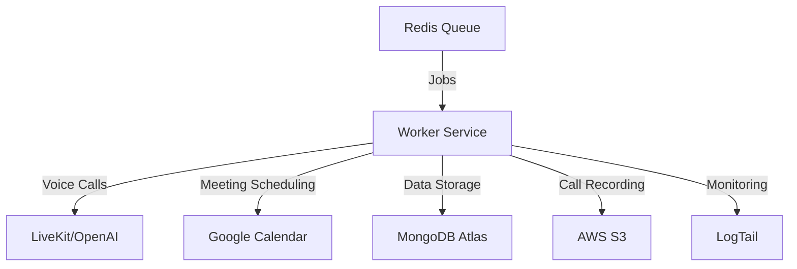
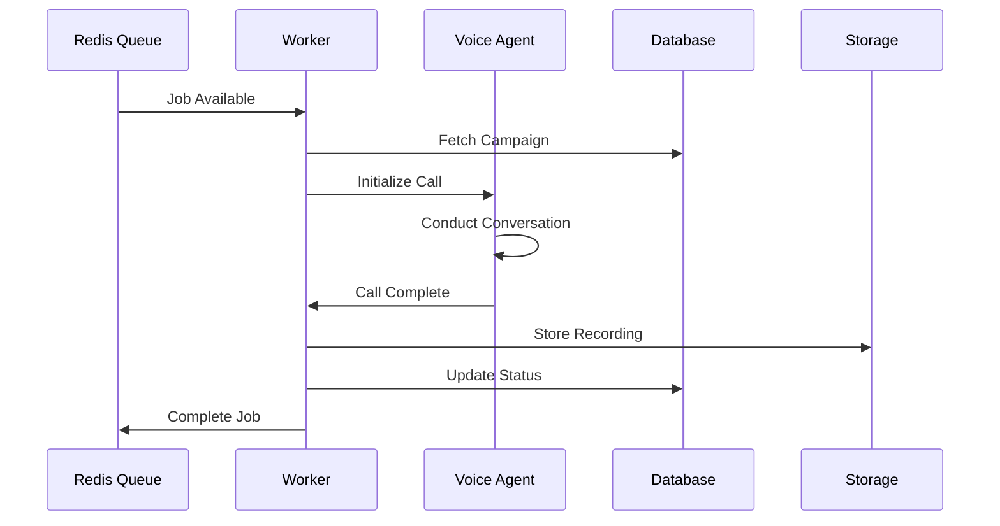
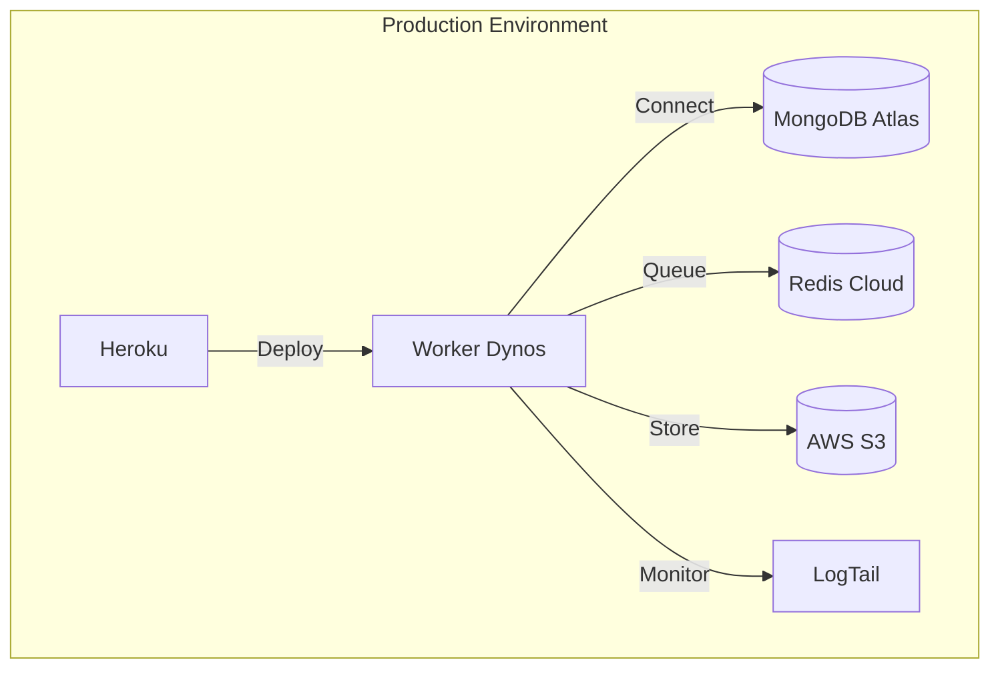

# DocShield AI Voice Agent

[](https://github.com/docshield/ai-voice-agent/actions)


An autonomous sales outreach system that conducts malpractice insurance sales calls to medical practices using advanced AI voice synthesis and natural conversation capabilities.

## System Overview

DocShield's AI Voice Agent is a cutting-edge autonomous sales system that:

- Conducts natural voice conversations using LiveKit and OpenAI's Realtime API
- Navigates complex phone trees to reach decision makers
- Manages the complete sales process from outreach to meeting scheduling
- Operates 24/7 with parallel processing capabilities
- Maintains consistent messaging and professional interactions



## Key Features

- **Autonomous Voice Conversations**: Leverages LiveKit/OpenAI for natural dialogue
- **Intelligent Navigation**: Dynamic phone tree navigation using DTMF
- **Real-time Sales Coaching**: AI-powered conversation monitoring and guidance
- **Automated Scheduling**: Seamless Google Calendar integration
- **Enterprise-grade Security**: End-to-end encryption and compliance measures
- **Scalable Architecture**: Horizontally scalable worker processes

## Prerequisites

- Node.js >= 18.0.0
- NPM >= 8.0.0
- MongoDB Atlas account
- Redis Cloud instance
- AWS S3 bucket
- LiveKit/OpenAI API access
- Google Cloud project with Calendar API enabled

## Installation

```bash
# Clone the repository
git clone https://github.com/docshield/ai-voice-agent.git

# Install dependencies
cd ai-voice-agent
npm install

# Configure environment
cp .env.example .env
# Edit .env with your credentials

# Build TypeScript
npm run build

# Start worker process
npm run start-worker
```

## Environment Configuration

```env
# Core Services
LIVEKIT_API_KEY=your_api_key
OPENAI_API_KEY=your_api_key
GOOGLE_OAUTH_CREDENTIALS=your_credentials

# Database
MONGODB_URI=mongodb+srv://...
REDIS_URL=redis://...

# Storage
AWS_ACCESS_KEY_ID=your_access_key
AWS_SECRET_ACCESS_KEY=your_secret_key
AWS_REGION=us-east-1
S3_BUCKET=your_bucket_name

# Monitoring
LOGTAIL_SOURCE_TOKEN=your_token

# Worker Configuration
WORKER_CONCURRENCY=1
LOG_LEVEL=info
```

## System Architecture



## Development

### Local Development

1. Install dependencies: `npm install`
2. Configure environment variables
3. Start development server: `npm run dev`
4. Run tests: `npm test`

### Code Structure

```
.
├── src/
│   ├── worker/         # Worker service implementation
│   ├── voice-agent/    # Voice synthesis and control
│   ├── integrations/   # External service integrations
│   └── utils/          # Shared utilities
├── tests/              # Test suites
├── infrastructure/     # Deployment configurations
└── docs/              # Additional documentation
```

## Deployment

### Production Deployment

1. Configure Heroku environment
2. Set up MongoDB Atlas cluster
3. Provision Redis Cloud instance
4. Configure AWS S3 bucket
5. Deploy: `git push heroku main`

### Infrastructure



## Monitoring

- Real-time metrics via LogTail dashboard
- Worker health checks every 30 seconds
- Automated error alerting
- Performance monitoring and scaling triggers

## Security

- End-to-end encryption for all communications
- Secure credential management via environment variables
- Regular security audits and dependency updates
- Compliance with HIPAA and TCPA regulations

## Documentation

- [API Documentation](./docs/api.md)
- [Worker Service Guide](./docs/worker.md)
- [Voice Agent Configuration](./docs/voice-agent.md)
- [Deployment Guide](./docs/deployment.md)

## Contributing

1. Fork the repository
2. Create feature branch: `git checkout -b feature/name`
3. Commit changes: `git commit -am 'Add feature'`
4. Push branch: `git push origin feature/name`
5. Submit pull request

## License

UNLICENSED - Proprietary software

## Maintainers

- DocShield Engineering Team

---

Last updated: 2024