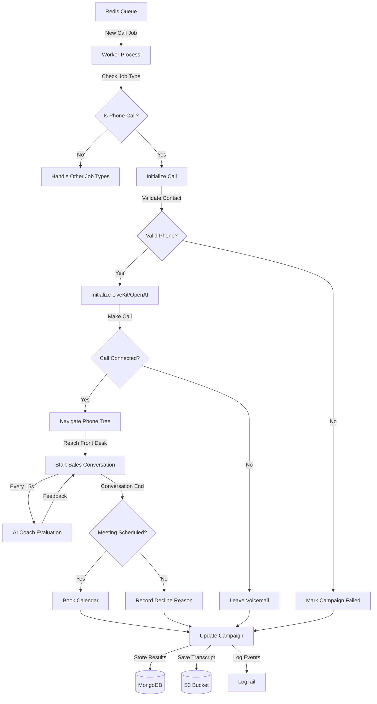
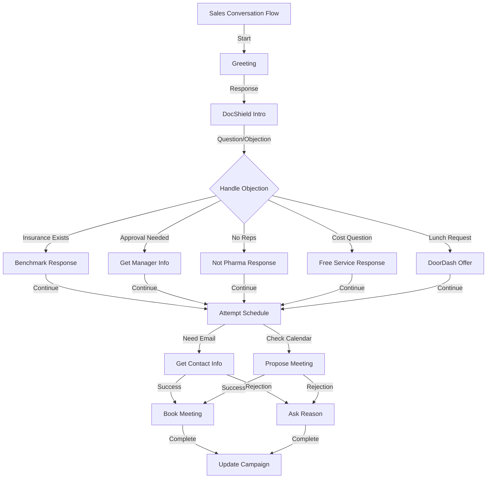
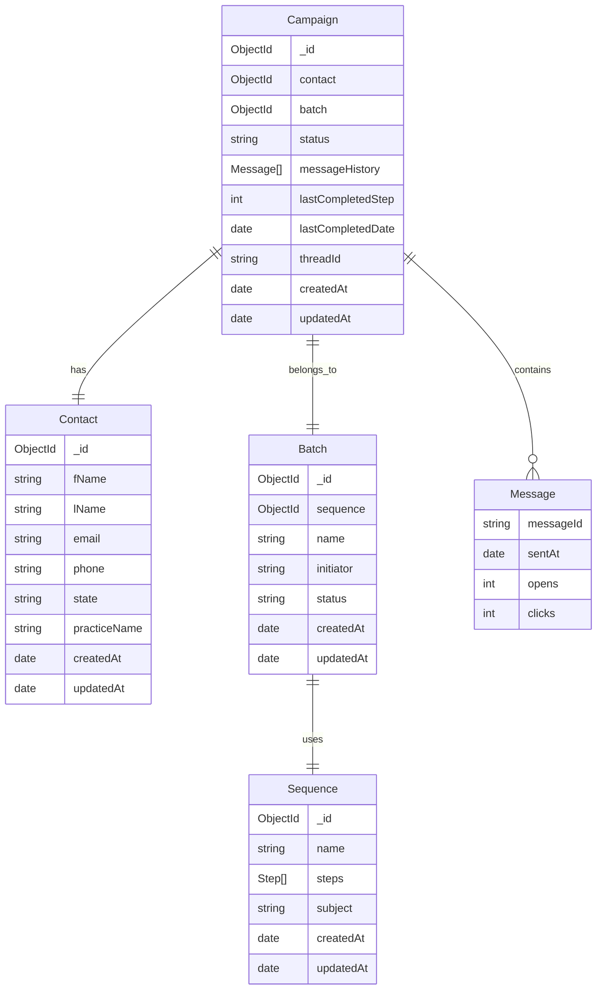
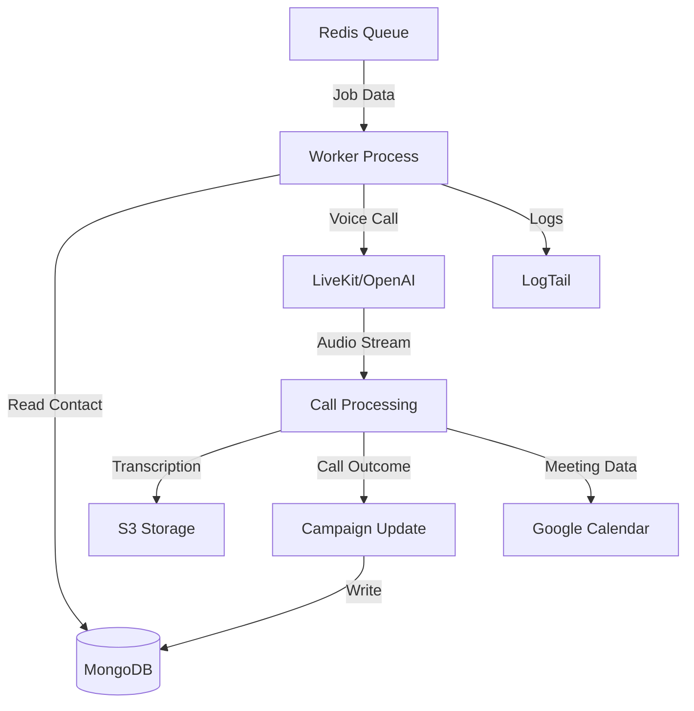
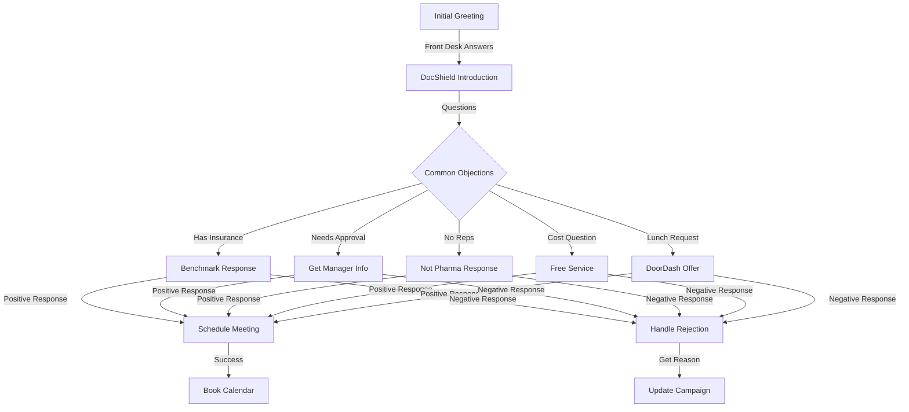

# Product Requirements Document (PRD)

# 1. INTRODUCTION

## 1.1 Purpose

This Product Requirements Document (PRD) specifies the requirements for an autonomous AI voice agent worker application that conducts outbound sales calls to medical practices on behalf of DocShield. The document serves as a comprehensive guide for the development team implementing the system and provides technical specifications for:

- Engineering teams building the worker application
- QA teams validating the voice agent functionality
- Operations teams managing deployment and monitoring
- Product teams tracking feature implementation

## 1.2 Scope

The software system encompasses a node worker application that:

- Consumes jobs from a Redis queue to initiate outbound sales calls
- Leverages LiveKit and OpenAI Realtime API to conduct natural voice conversations
- Navigates phone trees to reach practice front desk staff
- Follows dynamic sales scripts with personalized information
- Records call transcripts and updates campaign status
- Books meetings via Google Calendar integration
- Updates MongoDB with call outcomes and campaign progression

Key benefits include:

- Fully autonomous sales outreach requiring no human intervention
- Consistent messaging and objection handling across all calls
- Scalable outreach capacity through parallel worker processes
- Detailed call transcripts and campaign analytics
- Integration with existing sales sequencing tools

Out of scope:

- Front-end interface development
- Inbound call handling
- SMS/text message capabilities
- Payment processing
- Insurance policy management

# 2. PRODUCT DESCRIPTION

## 2.1 Product Perspective

The autonomous AI voice agent worker application operates as a component within DocShield's larger sales automation ecosystem:

- Consumes outbound call jobs from Redis queue populated by existing sales sequencing tools
- Integrates with LiveKit/OpenAI Realtime API for voice synthesis and natural conversation
- Connects to MongoDB for campaign/contact data and status tracking
- Interfaces with Google Calendar API for meeting scheduling
- Uploads call transcripts to S3 for record keeping
- Reports to LogTail for operational monitoring

## 2.2 Product Functions

The worker application performs these core functions:

- Listens continuously to Redis queue for new outbound call jobs
- Initiates voice calls using LiveKit/OpenAI Realtime API
- Navigates automated phone trees to reach practice staff
- Conducts natural sales conversations following provided scripts
- Handles common objections using predefined responses
- Records and transcribes call audio
- Books meetings via Google Calendar when successful
- Updates campaign status and history in MongoDB
- Manages parallel worker processes for scalability

## 2.3 User Characteristics

Primary Users:
- Sales Operations Team
  - Technical expertise: Moderate
  - Responsible for: Monitoring worker performance, managing campaigns
  - Key needs: Reliable call execution, accurate reporting

End Users (Call Recipients):
- Medical Practice Front Desk Staff
  - Technical expertise: Basic
  - Context: Busy healthcare environment
  - Key needs: Clear communication, efficient interactions
  
- Practice Administrators
  - Technical expertise: Moderate
  - Context: Decision makers for practice operations
  - Key needs: Professional presentation, value proposition clarity

## 2.4 Constraints

Technical Constraints:
- Must operate within Heroku eco dynos resource limits
- Limited to single concurrent call per worker instance
- Voice synthesis quality dependent on OpenAI/LiveKit capabilities
- Network latency impacts real-time conversation quality

Regulatory Constraints:
- Cannot present as licensed insurance agent
- Must disclose AI nature when asked
- Must avoid emergency line selections in phone trees
- Cannot provide specific policy advice

Business Constraints:
- Meeting scheduling limited to available calendar slots
- Must maintain professional tone regardless of recipient behavior
- Cannot deviate from approved script content

## 2.5 Assumptions and Dependencies

Assumptions:
- Redis queue will maintain reliable job delivery
- Practice phone numbers are valid and operational
- Staff will be available during business hours
- Internet connectivity sufficient for voice calls
- Phone systems allow automated navigation

Dependencies:
- LiveKit/OpenAI Realtime API availability
- MongoDB database uptime
- Redis queue system stability
- Google Calendar API access
- S3 storage availability
- LogTail logging service
- Sales sequencing tool integration

# 3. PROCESS FLOWCHART

## 4.1 Core Voice Agent Features

### F1. Redis Queue Consumer
**Priority: P0**
| Requirement ID | Description |
|---------------|-------------|
| F1.1 | Listen continuously to Redis queue for new outbound call jobs |
| F1.2 | Parse job payload to extract campaign ID, step number, and contact details |
| F1.3 | Validate phone number format before initiating call |
| F1.4 | Handle queue connection errors and job processing failures gracefully |

### F2. Voice Call Management  
**Priority: P0**
| Requirement ID | Description |
|---------------|-------------|
| F2.1 | Initialize LiveKit/OpenAI Realtime API connection for outbound calls |
| F2.2 | Manage call state transitions (dialing, connected, disconnected) |
| F2.3 | Handle network interruptions and call drops with retry logic |
| F2.4 | Detect when call is answered vs voicemail |
| F2.5 | Record call audio and generate text transcription |

### F3. Phone Tree Navigation
**Priority: P1**
| Requirement ID | Description |
|---------------|-------------|
| F3.1 | Detect and parse automated phone menu options |
| F3.2 | Select appropriate options to reach front desk (e.g. scheduling) |
| F3.3 | Avoid emergency/urgent care menu options |
| F3.4 | Handle multi-level phone trees with branching logic |
| F3.5 | Detect when live person is reached |

### F4. Conversation Management
**Priority: P0**
| Requirement ID | Description |
|---------------|-------------|
| F4.1 | Load and interpolate conversation script with contact details |
| F4.2 | Maintain context throughout conversation flow |
| F4.3 | Handle interruptions and topic changes naturally |
| F4.4 | Detect and respond to common objections from script |
| F4.5 | Identify optimal moments to attempt meeting scheduling |

### F5. AI Sales Coach
**Priority: P1**
| Requirement ID | Description |
|---------------|-------------|
| F5.1 | Initialize separate AI instance to monitor conversation |
| F5.2 | Evaluate conversation progress every 15 seconds |
| F5.3 | Provide real-time guidance to voice agent when needed |
| F5.4 | Track completion of key conversation objectives |
| F5.5 | Suggest tactical adjustments based on recipient responses |

### F6. Meeting Scheduling
**Priority: P0**
| Requirement ID | Description |
|---------------|-------------|
| F6.1 | Check Google Calendar availability in real-time |
| F6.2 | Collect recipient email for calendar invite |
| F6.3 | Create and send calendar invites via Google Calendar API |
| F6.4 | Handle scheduling conflicts and reschedule requests |
| F6.5 | Confirm meeting details verbally before ending call |

### F7. Campaign Updates
**Priority: P0**
| Requirement ID | Description |
|---------------|-------------|
| F7.1 | Record call outcomes in MongoDB campaign records |
| F7.2 | Upload call transcripts to S3 with campaign reference |
| F7.3 | Update campaign status based on call result |
| F7.4 | Track objections and decline reasons when provided |
| F7.5 | Log detailed call analytics and duration |

### F8. Error Handling
**Priority: P0**
| Requirement ID | Description |
|---------------|-------------|
| F8.1 | Implement comprehensive error logging via LogTail |
| F8.2 | Handle API failures gracefully (LiveKit, OpenAI, Google) |
| F8.3 | Manage database connection issues and retries |
| F8.4 | Report critical errors to monitoring system |
| F8.5 | Maintain audit trail of system failures |

# 5. NON-FUNCTIONAL REQUIREMENTS

## 5.1 Performance Requirements

| Requirement | Description | Target Metric |
|-------------|-------------|---------------|
| Response Time | Maximum latency for voice agent responses during conversation | < 1.5 seconds |
| Call Setup Time | Time from job receipt to call initiation | < 3 seconds |
| Voice Quality | Minimum voice synthesis quality score | > 8/10 rating |
| Resource Usage | Maximum memory usage per worker process | < 512MB |
| CPU Utilization | Maximum CPU usage per worker process | < 80% |
| Concurrent Calls | Maximum parallel calls per worker instance | 1 call |
| Queue Processing | Maximum time to process new redis queue jobs | < 500ms |

## 5.2 Safety Requirements

| Requirement | Description |
|-------------|-------------|
| Graceful Degradation | System must maintain core functionality during partial service outages |
| Data Backup | Call transcripts and campaign data backed up to S3 within 5 minutes |
| Error Recovery | Automatic retry mechanism for failed API calls with exponential backoff |
| Circuit Breaking | Automatic service isolation when dependency failure thresholds exceeded |
| State Management | Persistent state tracking to prevent duplicate calls or lost progress |
| Monitoring Alerts | Real-time alerts via LogTail for critical system failures |

## 5.3 Security Requirements

| Requirement | Description |
|-------------|-------------|
| Data Encryption | All call recordings and transcripts encrypted at rest in S3 |
| Access Control | Role-based access control for campaign and contact data |
| API Security | All external API communications secured via TLS 1.3 |
| Credential Management | Secure storage of API keys and tokens in environment variables |
| Audit Logging | Comprehensive audit trail of all system actions via LogTail |
| Data Retention | Automated purging of sensitive data after retention period |

## 5.4 Quality Requirements

### 5.4.1 Availability
- System uptime: 99.9% during business hours (8am-6pm local time)
- Maximum planned downtime: 4 hours per month
- Recovery Time Objective (RTO): < 15 minutes
- Recovery Point Objective (RPO): < 5 minutes

### 5.4.2 Maintainability
- Code documentation coverage: > 80%
- Maximum cyclomatic complexity: 15
- Test coverage: > 85%
- Automated deployment pipeline
- Standardized logging format

### 5.4.3 Usability
- Voice agent comprehension rate: > 95%
- Natural conversation flow score: > 8/10
- Maximum silence duration: < 2 seconds
- Clear pronunciation score: > 9/10

### 5.4.4 Scalability
- Horizontal scaling up to 100 worker instances
- Auto-scaling based on queue length
- Maximum queue processing delay: 30 seconds
- Linear performance degradation under load

### 5.4.5 Reliability
- Maximum failed call rate: < 2%
- API service availability: 99.95%
- Database transaction success rate: 99.99%
- Message queue delivery guarantee: at-least-once

## 5.5 Compliance Requirements

| Requirement | Description |
|-------------|-------------|
| Call Recording | Compliance with state-specific call recording laws |
| AI Disclosure | Clear disclosure of AI nature when asked |
| Insurance Regulations | No representation as licensed insurance agent |
| Data Privacy | HIPAA compliance for any collected healthcare information |
| Call Hours | Adherence to TCPA regulations for outbound calling hours |
| Record Keeping | Maintenance of call records for regulatory compliance |
| Opt-Out Handling | Honor and track do-not-call requests |

# 6. DATA REQUIREMENTS

## 6.1 Data Models

## 6.2 Data Storage

### 6.2.1 Primary Storage
- MongoDB for structured data (campaigns, contacts, sequences)
  - Indexed collections for optimized query performance
  - Sharded collections for horizontal scaling
  - Write concern: majority with journal
  - Read preference: primaryPreferred

### 6.2.2 Queue Storage
- Redis for job queue management
  - Persistence mode: RDB snapshots every 5 minutes
  - AOF enabled with fsync every second
  - Key expiration policies for completed jobs

### 6.2.3 Call Records
- S3 for call recordings and transcripts
  - Lifecycle policies: move to IA after 30 days
  - Glacier deep archive after 90 days
  - Versioning enabled for audit trail
  - Server-side encryption with KMS

### 6.2.4 Backup Strategy
- MongoDB
  - Daily full backups to S3
  - Point-in-time recovery with oplog
  - Cross-region backup replication
  - 30-day retention period

- Redis
  - Hourly RDB snapshots to S3
  - Standby replica in different AZ
  - 7-day backup retention

## 6.3 Data Processing

### 6.3.1 Data Security
- Encryption at rest
  - MongoDB: Collection-level encryption
  - S3: SSE-KMS encryption
  - Redis: TLS encryption
  
- Encryption in transit
  - TLS 1.3 for all API communications
  - VPC encryption for internal traffic
  - Encrypted Redis connections

### 6.3.2 Data Access Controls
- Role-based access control (RBAC)
  - Worker service account permissions
  - Admin access restrictions
  - Audit logging of all data access

### 6.3.3 Data Retention
- Call recordings: 90 days
- Call transcripts: 1 year
- Campaign data: 3 years
- Contact information: Until opt-out
- System logs: 30 days

### 6.3.4 Data Compliance
- HIPAA compliance for PHI
- TCPA compliance for call records
- State-specific call recording laws
- Data residency requirements
- Audit trail maintenance

# 7. EXTERNAL INTERFACES

## 7.1 Software Interfaces

### 7.1.1 LiveKit/OpenAI Integration
| Interface | Specification |
|-----------|---------------|
| Protocol | WebSocket, REST API |
| Data Format | JSON, Audio Stream |
| Authentication | API Key, Bearer Token |
| Rate Limits | As per OpenAI/LiveKit quotas |
| Error Handling | Exponential backoff retry |

### 7.1.2 Redis Queue
| Interface | Specification |
|-----------|---------------|
| Protocol | Redis Protocol (RESP) |
| Connection | TLS encrypted |
| Queue Structure | Bull queue framework |
| Data Format | JSON job payloads |
| Persistence | RDB snapshots, AOF logs |

### 7.1.3 MongoDB Database
| Interface | Specification |
|-----------|---------------|
| Protocol | MongoDB Wire Protocol |
| Connection | TLS encrypted |
| Authentication | Username/Password |
| Data Format | BSON documents |
| Collections | Campaigns, Contacts, Batches, Sequences |

### 7.1.4 Google Calendar API
| Interface | Specification |
|-----------|---------------|
| Protocol | REST API |
| Authentication | OAuth 2.0 |
| Data Format | JSON |
| Scope | calendar.events |
| Rate Limits | Google Calendar quotas |

### 7.1.5 AWS S3
| Interface | Specification |
|-----------|---------------|
| Protocol | REST API |
| Authentication | IAM credentials |
| Data Format | Binary (audio), Text (transcripts) |
| Encryption | Server-side encryption |
| Access Control | Bucket policies |

## 7.2 Communication Interfaces

### 7.2.1 Voice Call Interface
| Requirement | Specification |
|-------------|---------------|
| Protocol | SIP/RTP |
| Audio Codec | Opus |
| Sample Rate | 48kHz |
| Bit Rate | 32-128 kbps adaptive |
| Latency | < 150ms |

### 7.2.2 Phone System Integration
| Requirement | Specification |
|-------------|---------------|
| DTMF Support | RFC 4733 |
| Call Control | SIP INFO messages |
| Audio Detection | Voice activity detection |
| Phone Tree | DTMF navigation capability |
| Call Recording | Dual channel recording |

### 7.2.3 Network Requirements
| Requirement | Specification |
|-------------|---------------|
| Bandwidth | Minimum 100 Kbps up/down |
| Jitter | < 30ms |
| Packet Loss | < 1% |
| QoS | Voice traffic prioritization |
| Firewall | UDP ports 10000-20000 |

## 7.3 Hardware Interfaces

### 7.3.1 Server Requirements
| Component | Specification |
|-----------|---------------|
| CPU | 1 vCPU per worker |
| Memory | 512MB RAM per worker |
| Storage | 20GB SSD |
| Network | 1Gbps NIC |
| Platform | Heroku eco dyno |

## 7.4 Monitoring Interfaces

### 7.4.1 LogTail Integration
| Interface | Specification |
|-----------|---------------|
| Protocol | HTTPS |
| Authentication | Source token |
| Data Format | Structured JSON logs |
| Retention | 30 days |
| Real-time | < 2s ingestion delay |

### 7.4.2 Health Checks
| Interface | Specification |
|-----------|---------------|
| Protocol | HTTP/HTTPS |
| Endpoints | /health, /metrics |
| Format | JSON status response |
| Interval | 30 second checks |
| Timeout | 5 second timeout |

# APPENDICES

## A. GLOSSARY

| Term | Definition |
|------|------------|
| Voice Agent | AI-powered autonomous calling system that conducts sales conversations |
| Sales Coach | Secondary AI system monitoring call progress and providing guidance |
| Phone Tree | Automated menu system used by medical practices to route calls |
| Front Desk Staff | Medical practice receptionist who typically answers incoming calls |
| Practice Administrator | Manager responsible for business operations of medical practice |
| Malpractice Insurance | Professional liability insurance for medical practitioners |
| DoorDash Credit | Incentive offered to practices in form of food delivery credit |

## B. ACRONYMS

| Acronym | Definition |
|---------|------------|
| AI | Artificial Intelligence |
| API | Application Programming Interface |
| BSON | Binary JSON |
| CPU | Central Processing Unit |
| DTMF | Dual-Tone Multi-Frequency |
| HIPAA | Health Insurance Portability and Accountability Act |
| IAM | Identity and Access Management |
| JSON | JavaScript Object Notation |
| KMS | Key Management Service |
| NIC | Network Interface Card |
| PHI | Protected Health Information |
| RBAC | Role-Based Access Control |
| RESP | Redis Serialization Protocol |
| RTP | Real-time Transport Protocol |
| S3 | Simple Storage Service |
| SIP | Session Initiation Protocol |
| SSL | Secure Sockets Layer |
| TCPA | Telephone Consumer Protection Act |
| TLS | Transport Layer Security |
| UDP | User Datagram Protocol |
| VPC | Virtual Private Cloud |

## C. ADDITIONAL REFERENCES

### C.1 Technical Documentation
- [LiveKit OpenAI Agent Documentation](https://docs.livekit.io/agents/openai/overview/)
- [Redis Bull Queue Documentation](https://github.com/OptimalBits/bull)
- [MongoDB Node.js Driver Documentation](https://mongodb.github.io/node-mongodb-native/)
- [Google Calendar API Documentation](https://developers.google.com/calendar)

### C.2 Regulatory Resources
- HIPAA Compliance Guidelines
- TCPA Regulations for Automated Calling
- State-specific Call Recording Laws
- Insurance Producer Licensing Requirements

### C.3 Integration References
- LogTail API Documentation
- Clerk Authentication Documentation
- AWS S3 SDK Documentation
- Google OAuth 2.0 Documentation

## D. SAMPLE CONVERSATION FLOWS

