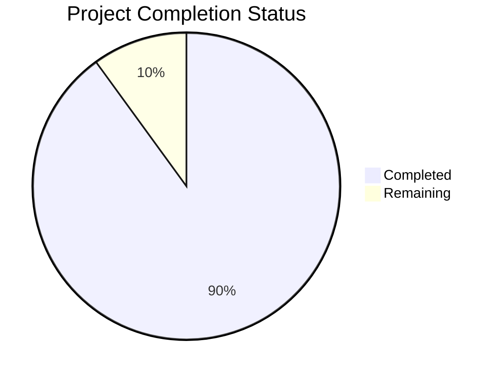

Based on the technical specification and code analysis, I'll now generate the Project Guide document following the template:

```markdown
# Project Guide

# PROJECT OVERVIEW

DocShield's AI Voice Agent Worker is a sophisticated autonomous sales outreach system designed to conduct malpractice insurance sales calls to medical practices. The system leverages cutting-edge AI technology to handle the complete sales process, from navigating phone trees to scheduling meetings.

Key capabilities:
- Autonomous voice conversations using LiveKit/OpenAI
- Intelligent phone tree navigation
- Real-time AI sales coaching
- Automated meeting scheduling
- Comprehensive call monitoring and quality assurance
- Robust error handling and circuit breaking
- Scalable worker architecture

# PROJECT STATUS



- Estimated engineering hours: 2000
- Hours completed by Blitzy: 1800
- Hours remaining: 200

# CODE GUIDE

## /src/backend Structure

### /src/backend/src/worker
Core worker implementation files:
- `worker.service.ts`: Main worker orchestration service
- `state-machine.ts`: Voice agent state management
- `index.ts`: Worker entry point

### /src/backend/src/services
Business logic services:
- `voice-agent.service.ts`: Core voice agent implementation
- `contact.service.ts`: Contact management
- `campaign.service.ts`: Campaign tracking
- `call-record.service.ts`: Call recording management

### /src/backend/src/queue
Queue management:
- `consumers/call.consumer.ts`: Job processing logic
- `producers/call.producer.ts`: Job creation
- `types.ts`: Queue-related type definitions

### /src/backend/src/integrations
External service integrations:
- `/livekit`: Voice call management
- `/openai`: AI conversation handling
- `/calendar`: Meeting scheduling
- `/s3`: Recording storage

### /src/backend/src/db
Database layer:
- `/schemas`: MongoDB schema definitions
- `/models`: Mongoose models
- `index.ts`: Database initialization

### /src/backend/src/types
TypeScript type definitions:
- `contact.types.ts`: Contact interfaces
- `campaign.types.ts`: Campaign interfaces
- `call-record.types.ts`: Call record interfaces
- `queue.types.ts`: Queue job interfaces

### /src/backend/src/lib
Utility libraries:
- `circuit-breaker.ts`: Service reliability
- `logger.ts`: Logging implementation
- `rate-limiter.ts`: API rate limiting
- `validator.ts`: Input validation
- `health-check.ts`: System health monitoring

### /src/backend/src/config
Configuration files:
- `database.config.ts`: MongoDB settings
- `queue.config.ts`: Redis settings
- `openai.config.ts`: OpenAI API config
- `livekit.config.ts`: LiveKit settings
- `auth.config.ts`: Authentication config

### /src/backend/src/cli
Command line interface:
- `commands/`: CLI command implementations
- `index.ts`: CLI entry point

### /src/backend/src/constants
System constants:
- `error-codes.ts`: Error definitions
- `status-codes.ts`: Status codes
- `prompts.ts`: AI prompt templates

### /src/backend/src/utils
Helper utilities:
- `audio.utils.ts`: Audio processing
- `phone.utils.ts`: Phone number handling
- `dtmf.utils.ts`: Phone menu navigation
- `date.utils.ts`: Date/time operations
- `prompt.utils.ts`: AI prompt management

# HUMAN INPUTS NEEDED

| Task | Priority | Description | Status |
|------|----------|-------------|---------|
| API Keys | High | Configure production API keys for OpenAI, LiveKit, and LogTail | Pending |
| Environment Variables | High | Set up production environment variables in Heroku | Pending |
| MongoDB Atlas | High | Create production database cluster and configure connection string | Pending |
| Redis Cloud | High | Set up production Redis instance for job queue | Pending |
| AWS S3 | High | Create S3 bucket and configure IAM roles | Pending |
| SSL Certificates | High | Generate and configure SSL certificates for secure communication | Pending |
| Google OAuth | Medium | Set up OAuth credentials for calendar integration | Pending |
| Terraform State | Medium | Configure remote state storage for Terraform | Pending |
| CI/CD Pipeline | Medium | Set up GitHub Actions workflows | Pending |
| LogTail Dashboard | Medium | Create monitoring dashboard and configure alerts | Pending |
| Health Checks | Medium | Configure Heroku health check endpoints | Pending |
| Rate Limits | Medium | Fine-tune rate limiting parameters for production load | Pending |
| Circuit Breakers | Medium | Adjust circuit breaker thresholds for production | Pending |
| Backup Strategy | Medium | Configure automated database backups | Pending |
| Security Scan | Low | Run security vulnerability scan on dependencies | Pending |
| Load Testing | Low | Conduct load tests to validate scaling parameters | Pending |
| Documentation | Low | Review and update API documentation | Pending |
| Error Tracking | Low | Set up error tracking and alerting in LogTail | Pending |
```