# Technical Specifications

# 1. INTRODUCTION

## 1.1 Executive Summary

DocShield's AI Voice Agent Worker is an autonomous sales outreach system that conducts malpractice insurance sales calls to medical practices. The system consumes jobs from a Redis queue, leverages LiveKit and OpenAI's Realtime API to conduct natural voice conversations, and manages the entire sales process from phone tree navigation to meeting scheduling. By automating outbound sales calls, the system enables DocShield's sales team to scale their outreach efforts while maintaining consistent messaging and professional interactions.

The system addresses the challenge of efficiently reaching independent physician practices to discuss malpractice insurance options, replacing manual cold calling with an AI-driven approach that can operate 24/7 and handle multiple conversations simultaneously through parallel worker processes.

## 1.2 System Overview

### Project Context

| Aspect | Description |
|--------|-------------|
| Market Position | First-to-market autonomous AI sales agent for malpractice insurance |
| Current Limitations | Manual cold calling limited by human capacity and working hours |
| Enterprise Integration | Interfaces with existing sales sequencing tool via Redis queue |

### High-Level Description

The system operates as a Node.js worker application with these core capabilities:

- Autonomous voice conversations using LiveKit/OpenAI Realtime API
- Dynamic script interpolation with contact-specific information
- Intelligent phone tree navigation to reach decision makers
- Real-time AI sales coaching and conversation monitoring
- Automated meeting scheduling via Google Calendar
- Campaign status tracking and transcript management

### Success Criteria

| Metric | Target |
|--------|---------|
| Call Completion Rate | > 95% of initiated calls reach a human |
| Meeting Booking Rate | > 15% of completed conversations |
| Voice Quality Score | > 8/10 on clarity and naturalness |
| System Uptime | 99.9% during business hours |
| Response Latency | < 1.5s for voice agent responses |

## 1.3 Scope

### In-Scope Features

| Category | Components |
|----------|------------|
| Core Functionality | - Redis queue job processing - Outbound voice calling - Phone tree navigation - Natural conversation handling - Meeting scheduling - Campaign status updates |
| Integrations | - LiveKit/OpenAI Realtime API - Google Calendar API - MongoDB database - S3 storage - LogTail monitoring |
| User Groups | - Medical practice front desk staff - Practice administrators - Physicians |
| Data Management | - Call recordings and transcripts - Campaign tracking - Contact information - Meeting schedules |

### Out-of-Scope Elements

- Frontend interface development
- Inbound call handling
- SMS/text messaging capabilities
- Payment processing
- Insurance policy management
- Manual call intervention capabilities
- Multi-language support
- Video call functionality
- CRM system development
- Mobile application development

# 2. SYSTEM ARCHITECTURE

## 2.1 High-Level Architecture

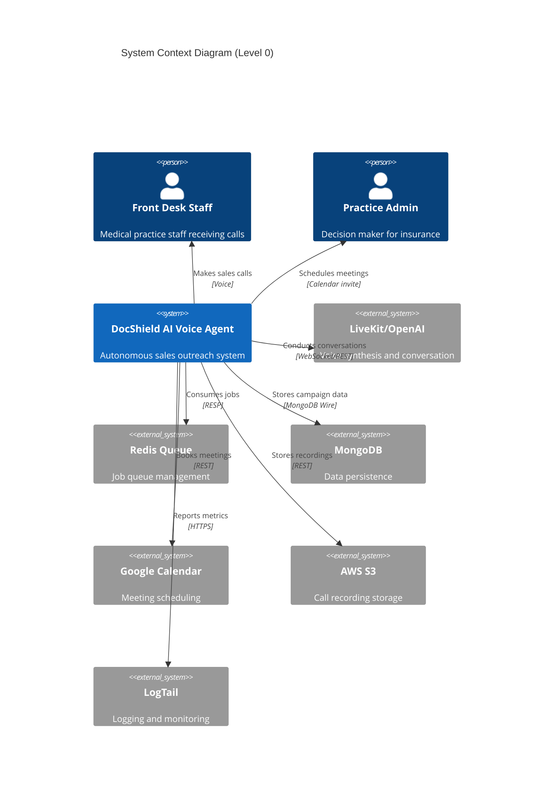
```mermaid
C4Context
    title System Context Diagram (Level 0)
    
    Person(frontDesk, "Front Desk Staff", "Medical practice staff receiving calls")
    Person(admin, "Practice Admin", "Decision maker for insurance")
    
    System(docShield, "DocShield AI Voice Agent", "Autonomous sales outreach system")
    
    System_Ext(liveKit, "LiveKit/OpenAI", "Voice synthesis and conversation")
    System_Ext(redis, "Redis Queue", "Job queue management")
    System_Ext(mongo, "MongoDB", "Data persistence")
    System_Ext(calendar, "Google Calendar", "Meeting scheduling")
    System_Ext(s3, "AWS S3", "Call recording storage")
    System_Ext(logTail, "LogTail", "Logging and monitoring")

    Rel(docShield, frontDesk, "Makes sales calls", "Voice")
    Rel(docShield, admin, "Schedules meetings", "Calendar invite")
    
    Rel(docShield, liveKit, "Conducts conversations", "WebSocket/REST")
    Rel(docShield, redis, "Consumes jobs", "RESP")
    Rel(docShield, mongo, "Stores campaign data", "MongoDB Wire")
    Rel(docShield, calendar, "Books meetings", "REST")
    Rel(docShield, s3, "Stores recordings", "REST")
    Rel(docShield, logTail, "Reports metrics", "HTTPS")
```

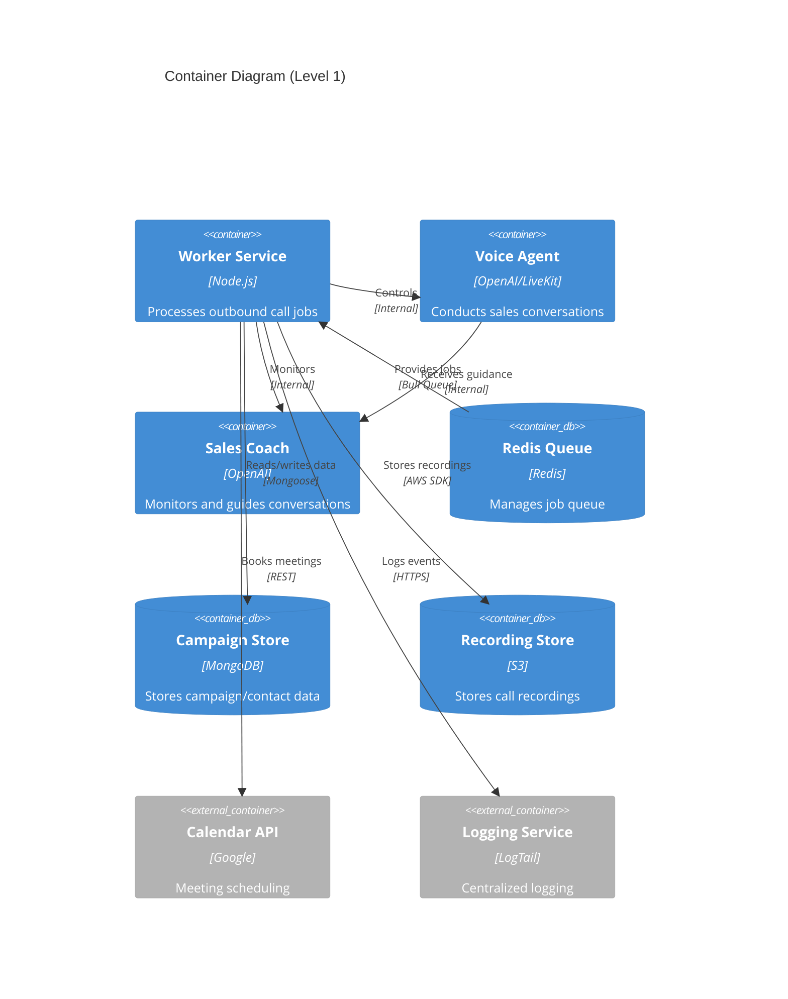
```mermaid
C4Container
    title Container Diagram (Level 1)
    
    Container(worker, "Worker Service", "Node.js", "Processes outbound call jobs")
    Container(voiceAgent, "Voice Agent", "OpenAI/LiveKit", "Conducts sales conversations")
    Container(salesCoach, "Sales Coach", "OpenAI", "Monitors and guides conversations")
    
    ContainerDb(redis, "Redis Queue", "Redis", "Manages job queue")
    ContainerDb(mongo, "Campaign Store", "MongoDB", "Stores campaign/contact data")
    ContainerDb(s3, "Recording Store", "S3", "Stores call recordings")
    
    Container_Ext(calendar, "Calendar API", "Google", "Meeting scheduling")
    Container_Ext(logTail, "Logging Service", "LogTail", "Centralized logging")
    
    Rel(redis, worker, "Provides jobs", "Bull Queue")
    Rel(worker, voiceAgent, "Controls", "Internal")
    Rel(worker, salesCoach, "Monitors", "Internal")
    Rel(voiceAgent, salesCoach, "Receives guidance", "Internal")
    
    Rel(worker, mongo, "Reads/writes data", "Mongoose")
    Rel(worker, s3, "Stores recordings", "AWS SDK")
    Rel(worker, calendar, "Books meetings", "REST")
    Rel(worker, logTail, "Logs events", "HTTPS")
```

## 2.2 Component Details

### 2.2.1 Worker Service Components

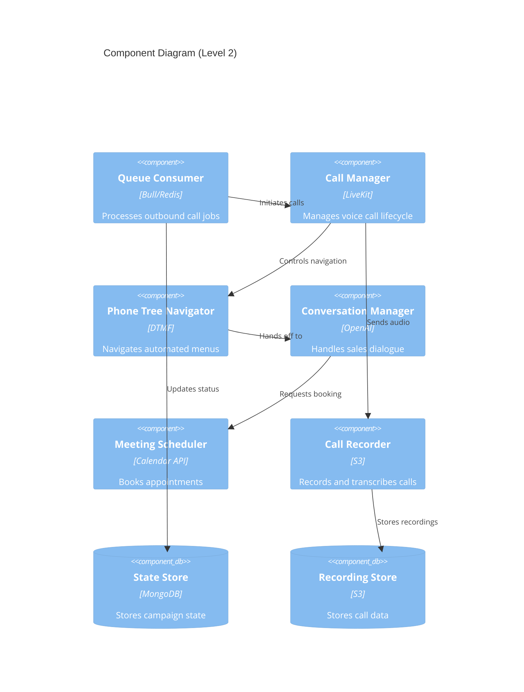
```mermaid
C4Component
    title Component Diagram (Level 2)
    
    Component(queue, "Queue Consumer", "Bull/Redis", "Processes outbound call jobs")
    Component(caller, "Call Manager", "LiveKit", "Manages voice call lifecycle")
    Component(navigator, "Phone Tree Navigator", "DTMF", "Navigates automated menus")
    Component(conversation, "Conversation Manager", "OpenAI", "Handles sales dialogue")
    Component(scheduler, "Meeting Scheduler", "Calendar API", "Books appointments")
    Component(recorder, "Call Recorder", "S3", "Records and transcribes calls")
    
    ComponentDb(state, "State Store", "MongoDB", "Stores campaign state")
    ComponentDb(storage, "Recording Store", "S3", "Stores call data")
    
    Rel(queue, caller, "Initiates calls")
    Rel(caller, navigator, "Controls navigation")
    Rel(navigator, conversation, "Hands off to")
    Rel(conversation, scheduler, "Requests booking")
    Rel(caller, recorder, "Sends audio")
    
    Rel(queue, state, "Updates status")
    Rel(recorder, storage, "Stores recordings")
```

### 2.2.2 Component Responsibilities

| Component | Purpose | Technology | Scaling Strategy |
|-----------|---------|------------|------------------|
| Queue Consumer | Job processing | Bull/Redis | Horizontal scaling |
| Call Manager | Voice call control | LiveKit | Single call per worker |
| Phone Navigator | Menu navigation | DTMF/Audio | Stateless processing |
| Conversation Manager | Sales dialogue | OpenAI | API quota management |
| Meeting Scheduler | Calendar integration | Google API | Request batching |
| Call Recorder | Audio capture | S3 SDK | Async processing |

## 2.3 Technical Decisions

### 2.3.1 Architecture Pattern

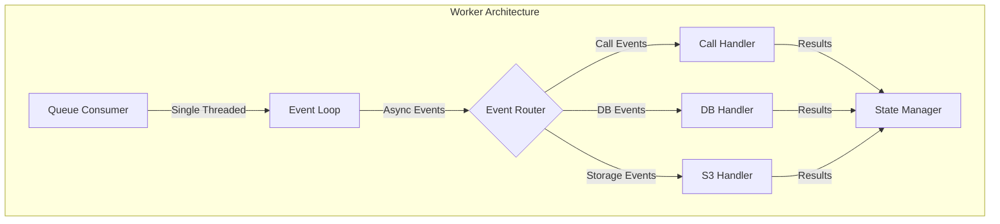
```mermaid
flowchart TD
    subgraph "Worker Architecture"
        A[Queue Consumer] -->|Single Threaded| B[Event Loop]
        B -->|Async Events| C{Event Router}
        C -->|Call Events| D[Call Handler]
        C -->|DB Events| E[DB Handler]
        C -->|Storage Events| F[S3 Handler]
        D & E & F -->|Results| G[State Manager]
    end
```

### 2.3.2 Data Flow Patterns

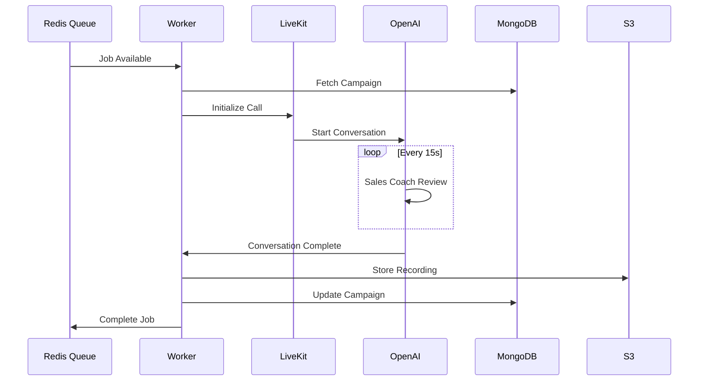
```mermaid
sequenceDiagram
    participant R as Redis Queue
    participant W as Worker
    participant L as LiveKit
    participant O as OpenAI
    participant M as MongoDB
    participant S as S3
    
    R->>W: Job Available
    W->>M: Fetch Campaign
    W->>L: Initialize Call
    L->>O: Start Conversation
    
    loop Every 15s
        O->>O: Sales Coach Review
    end
    
    O->>W: Conversation Complete
    W->>S: Store Recording
    W->>M: Update Campaign
    W->>R: Complete Job
```

## 2.4 Cross-Cutting Concerns

### 2.4.1 Monitoring Architecture

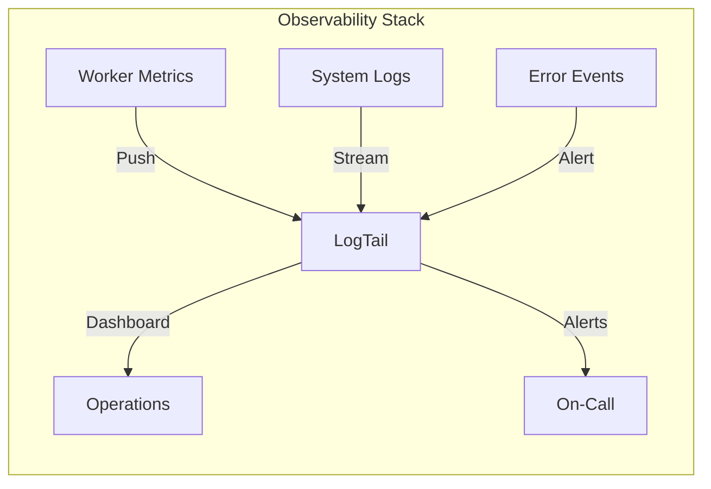
```mermaid
flowchart LR
    subgraph "Observability Stack"
        A[Worker Metrics] -->|Push| B[LogTail]
        C[System Logs] -->|Stream| B
        D[Error Events] -->|Alert| B
        B -->|Dashboard| E[Operations]
        B -->|Alerts| F[On-Call]
    end
```

### 2.4.2 Error Handling Strategy

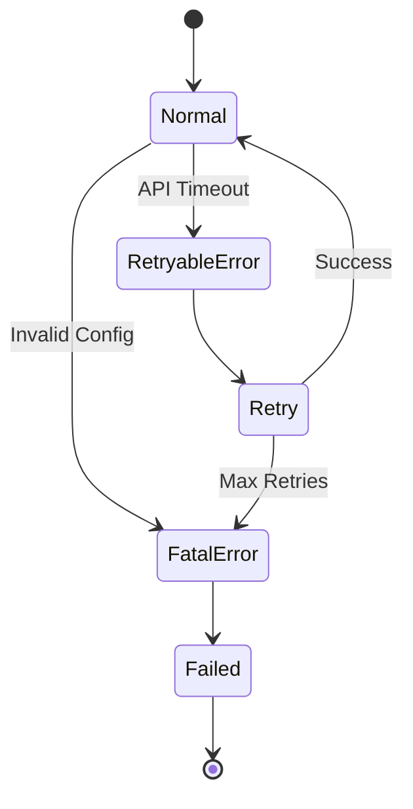
```mermaid
stateDiagram-v2
    [*] --> Normal
    Normal --> RetryableError: API Timeout
    Normal --> FatalError: Invalid Config
    RetryableError --> Retry
    Retry --> Normal: Success
    Retry --> FatalError: Max Retries
    FatalError --> Failed
    Failed --> [*]
```

## 2.5 Deployment Architecture

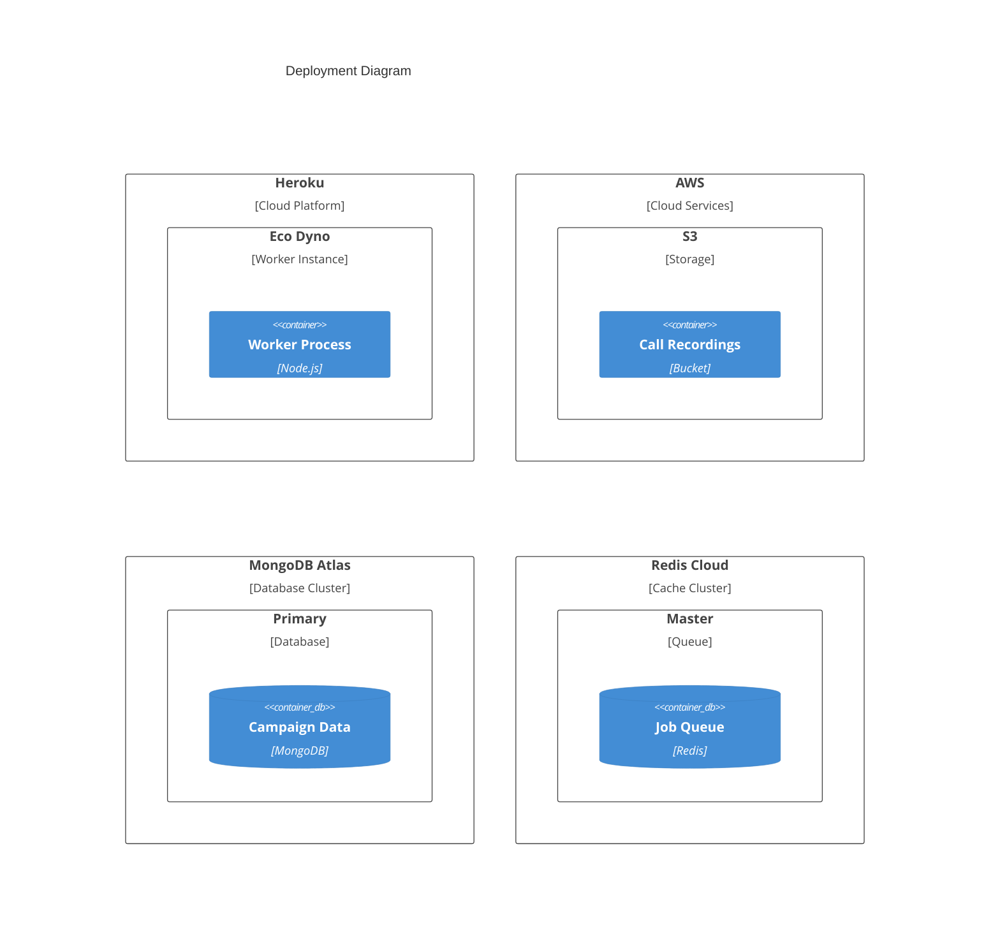
```mermaid
C4Deployment
    title Deployment Diagram
    
    Deployment_Node(heroku, "Heroku", "Cloud Platform") {
        Deployment_Node(dyno, "Eco Dyno", "Worker Instance") {
            Container(worker, "Worker Process", "Node.js")
        }
    }
    
    Deployment_Node(aws, "AWS", "Cloud Services") {
        Deployment_Node(s3, "S3", "Storage") {
            Container(recordings, "Call Recordings", "Bucket")
        }
    }
    
    Deployment_Node(mongo, "MongoDB Atlas", "Database Cluster") {
        Deployment_Node(primary, "Primary", "Database") {
            ContainerDb(db, "Campaign Data", "MongoDB")
        }
    }
    
    Deployment_Node(redis, "Redis Cloud", "Cache Cluster") {
        Deployment_Node(master, "Master", "Queue") {
            ContainerDb(queue, "Job Queue", "Redis")
        }
    }
```

# 3. SYSTEM COMPONENTS ARCHITECTURE

## 3.1 CLI Interface Design

### 3.1.1 Command Structure

| Command | Description | Arguments | Options |
|---------|-------------|-----------|----------|
| `start-worker` | Start worker process | None | `--env-file`, `--log-level` |
| `seed-queue` | Add test job to Redis | `campaignId` | `--step`, `--final` |
| `check-status` | View worker status | None | `--worker-id` |
| `stop-worker` | Gracefully stop worker | None | `--force` |

### 3.1.2 Input/Output Specifications

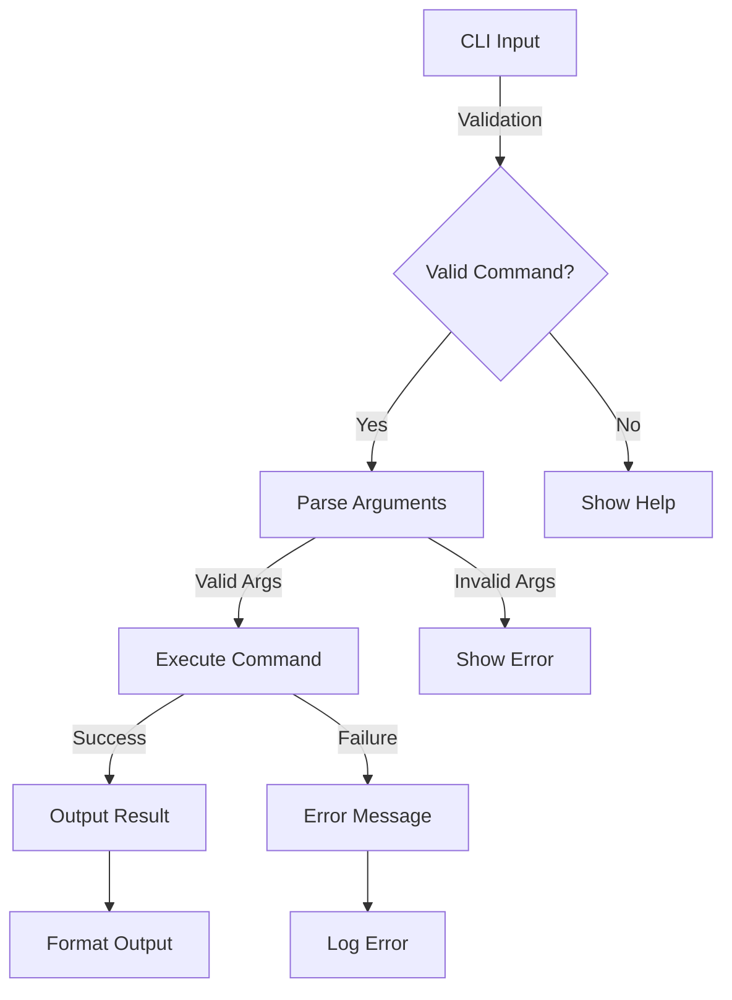
```mermaid
flowchart TD
    A[CLI Input] -->|Validation| B{Valid Command?}
    B -->|Yes| C[Parse Arguments]
    B -->|No| D[Show Help]
    C -->|Valid Args| E[Execute Command]
    C -->|Invalid Args| F[Show Error]
    E -->|Success| G[Output Result]
    E -->|Failure| H[Error Message]
    G --> I[Format Output]
    H --> J[Log Error]
```

### 3.1.3 Error Handling

| Error Type | Display Format | Action |
|------------|---------------|---------|
| Invalid Command | Red text with usage | Show help menu |
| Missing Arguments | Yellow warning with example | Show command help |
| Runtime Error | Red text with error code | Log to LogTail |
| Network Error | Orange text with retry info | Attempt reconnect |

## 3.2 Database Design

### 3.2.1 MongoDB Schema Design

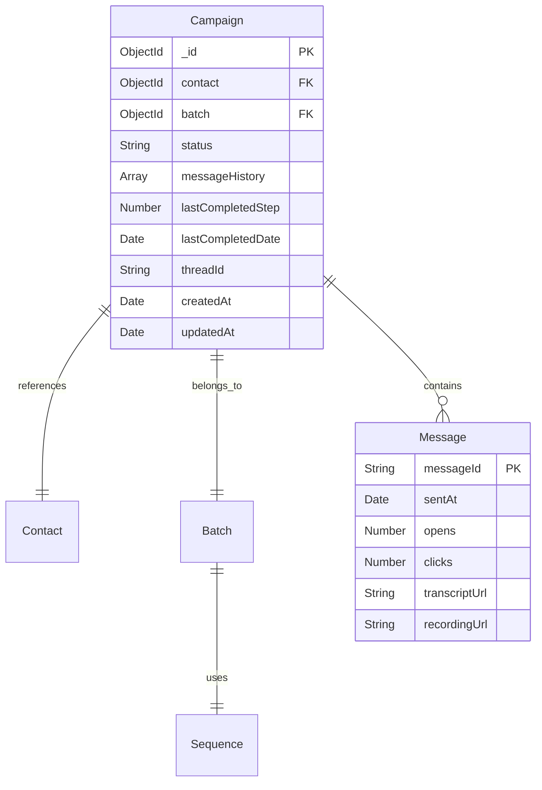
```mermaid
erDiagram
    Campaign ||--|| Contact : references
    Campaign ||--|| Batch : belongs_to
    Campaign ||--o{ Message : contains
    Batch ||--|| Sequence : uses
    
    Campaign {
        ObjectId _id PK
        ObjectId contact FK
        ObjectId batch FK
        String status
        Array messageHistory
        Number lastCompletedStep
        Date lastCompletedDate
        String threadId
        Date createdAt
        Date updatedAt
    }

    Message {
        String messageId PK
        Date sentAt
        Number opens
        Number clicks
        String transcriptUrl
        String recordingUrl
    }
```

### 3.2.2 Indexing Strategy

| Collection | Index | Type | Purpose |
|------------|-------|------|---------|
| Campaign | `{contact: 1}` | Single | Contact lookup |
| Campaign | `{batch: 1, status: 1}` | Compound | Status queries |
| Campaign | `{lastCompletedDate: 1}` | Single | Date filtering |
| Message | `{messageId: 1}` | Unique | Message lookup |
| Contact | `{phone: 1}` | Single | Phone lookup |

### 3.2.3 Data Management

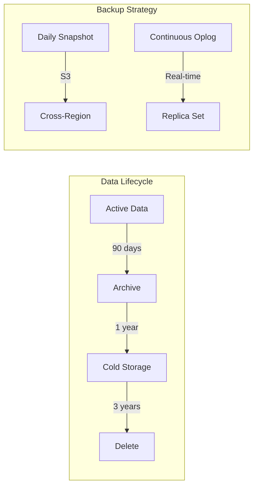
```mermaid
flowchart LR
    subgraph "Data Lifecycle"
        A[Active Data] -->|90 days| B[Archive]
        B -->|1 year| C[Cold Storage]
        C -->|3 years| D[Delete]
    end

    subgraph "Backup Strategy"
        E[Daily Snapshot] -->|S3| F[Cross-Region]
        G[Continuous Oplog] -->|Real-time| H[Replica Set]
    end
```

## 3.3 API Integration Design

### 3.3.1 External API Interfaces

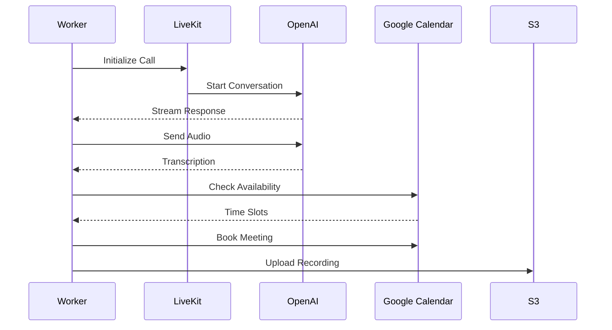
```mermaid
sequenceDiagram
    participant W as Worker
    participant L as LiveKit
    participant O as OpenAI
    participant G as Google Calendar
    participant S as S3

    W->>L: Initialize Call
    L->>O: Start Conversation
    O-->>W: Stream Response
    W->>O: Send Audio
    O-->>W: Transcription
    W->>G: Check Availability
    G-->>W: Time Slots
    W->>G: Book Meeting
    W->>S: Upload Recording
```

### 3.3.2 API Authentication

| Service | Auth Method | Token Type | Refresh Strategy |
|---------|-------------|------------|------------------|
| LiveKit | API Key | Bearer | Static |
| OpenAI | API Key | Bearer | Static |
| Google Calendar | OAuth 2.0 | Access Token | Refresh Token |
| S3 | IAM | Access Key | Role Rotation |
| LogTail | Source Token | Bearer | Static |

### 3.3.3 Integration Error Handling

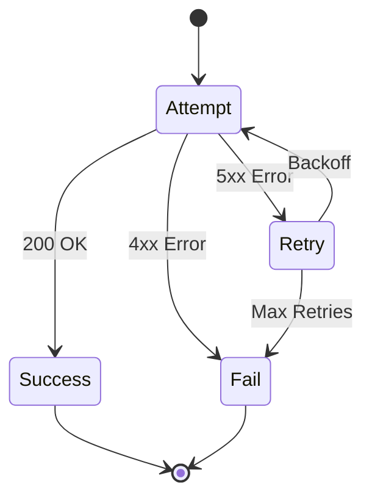
```mermaid
stateDiagram-v2
    [*] --> Attempt
    Attempt --> Success: 200 OK
    Attempt --> Retry: 5xx Error
    Attempt --> Fail: 4xx Error
    Retry --> Attempt: Backoff
    Retry --> Fail: Max Retries
    Success --> [*]
    Fail --> [*]
```

### 3.3.4 Rate Limiting Strategy

| Service | Limit | Window | Strategy |
|---------|-------|---------|-----------|
| LiveKit | 100 | Per minute | Token bucket |
| OpenAI | 3000 | Per minute | Leaky bucket |
| Google Calendar | 1M | Per day | Fixed window |
| S3 | 5500 | Per second | None |
| LogTail | 100 | Per second | Token bucket |

### 3.3.5 Circuit Breaker Configuration

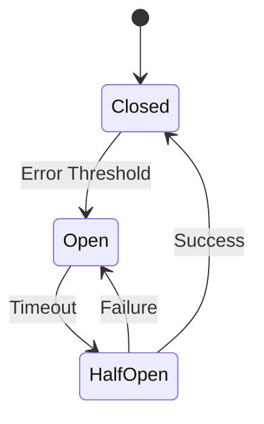
```mermaid
stateDiagram-v2
    [*] --> Closed
    Closed --> Open: Error Threshold
    Open --> HalfOpen: Timeout
    HalfOpen --> Closed: Success
    HalfOpen --> Open: Failure
```

| Service | Error Threshold | Timeout | Reset Time |
|---------|----------------|---------|------------|
| LiveKit | 5 errors/min | 30s | 60s |
| OpenAI | 3 errors/min | 45s | 90s |
| Google Calendar | 10 errors/min | 60s | 120s |
| S3 | 20 errors/min | 15s | 30s |

# 4. TECHNOLOGY STACK

## 4.1 PROGRAMMING LANGUAGES

| Platform | Language | Version | Justification |
|----------|----------|---------|---------------|
| Worker Service | TypeScript | 4.9+ | - Strong typing for complex voice agent logic - Native async/await support for API calls - Excellent ecosystem compatibility |
| Build Tools | Node.js | 18.x LTS | - Long-term support stability - Compatible with Heroku eco dynos - Efficient event loop for voice processing |

## 4.2 FRAMEWORKS & LIBRARIES

### 4.2.1 Core Frameworks

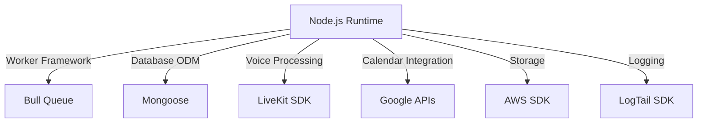
```mermaid
flowchart TD
    A[Node.js Runtime] -->|Worker Framework| B[Bull Queue]
    A -->|Database ODM| C[Mongoose]
    A -->|Voice Processing| D[LiveKit SDK]
    A -->|Calendar Integration| E[Google APIs]
    A -->|Storage| F[AWS SDK]
    A -->|Logging| G[LogTail SDK]
```

| Framework | Version | Purpose | Justification |
|-----------|---------|---------|---------------|
| Bull | 4.x | Queue processing | - Redis-based job management - Robust retry mechanisms - Event-based architecture |
| Mongoose | 7.x | MongoDB ODM | - Type-safe schemas - Rich query interface - Built-in validation |
| LiveKit SDK | Latest | Voice agent | - OpenAI integration - Real-time audio streaming - Call management |
| Google APIs | Latest | Calendar integration | - OAuth2 support - Meeting scheduling - Calendar management |

### 4.2.2 Supporting Libraries

| Library | Version | Purpose |
|---------|---------|---------|
| dotenv | 16.x | Environment configuration |
| node-fetch | 3.x | HTTP requests |
| winston | 3.x | Logging framework |
| uuid | 9.x | Unique ID generation |
| zod | 3.x | Runtime type validation |

## 4.3 DATABASES & STORAGE

### 4.3.1 Primary Database

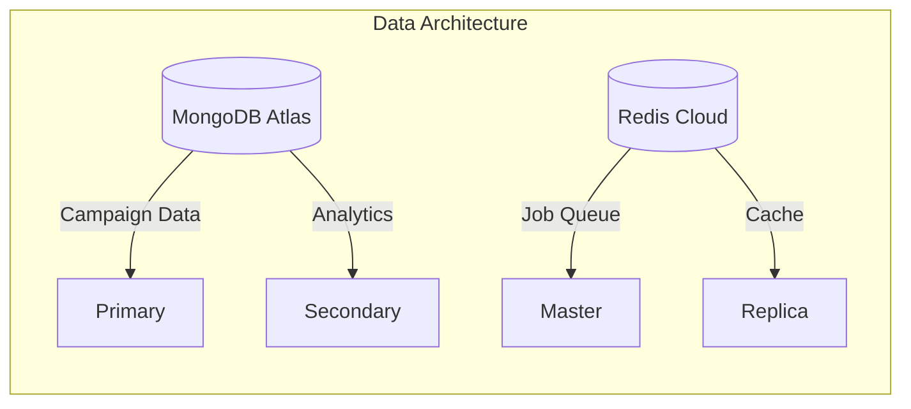
```mermaid
flowchart LR
    subgraph "Data Architecture"
        A[(MongoDB Atlas)] -->|Campaign Data| B[Primary]
        A -->|Analytics| C[Secondary]
        D[(Redis Cloud)] -->|Job Queue| E[Master]
        D -->|Cache| F[Replica]
    end
```

| Database | Purpose | Configuration |
|----------|---------|---------------|
| MongoDB Atlas | Campaign storage | - M10 cluster - 3 node replica set - Auto-scaling enabled |
| Redis Cloud | Queue management | - 100MB dedicated - Auto-failover - Persistence enabled |

### 4.3.2 Storage Services

| Service | Purpose | Configuration |
|---------|---------|---------------|
| AWS S3 | Call recordings | - Standard storage class - Server-side encryption - Lifecycle policies |
| Redis Cache | Session state | - In-memory cache - 1 hour TTL - LRU eviction |

## 4.4 THIRD-PARTY SERVICES

### 4.4.1 Core Services

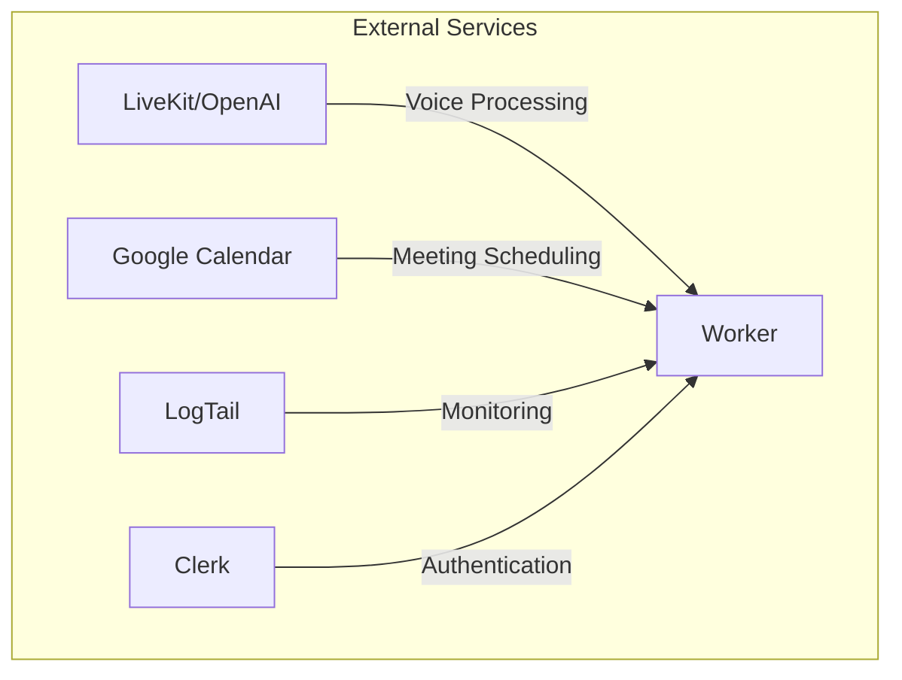
```mermaid
flowchart TD
    subgraph "External Services"
        A[LiveKit/OpenAI] -->|Voice Processing| B[Worker]
        C[Google Calendar] -->|Meeting Scheduling| B
        D[LogTail] -->|Monitoring| B
        E[Clerk] -->|Authentication| B
    end
```

| Service | Purpose | Integration Method |
|---------|---------|-------------------|
| LiveKit/OpenAI | Voice agent | REST/WebSocket API |
| Google Calendar | Scheduling | OAuth2.0 REST API |
| LogTail | Logging | HTTPS streaming |
| Clerk | Auth provider | SDK integration |

### 4.4.2 Service Dependencies

| Service | Dependency | Fallback |
|---------|------------|----------|
| LiveKit | OpenAI API | Graceful failure |
| Calendar | Google OAuth | Cache last token |
| MongoDB | Atlas cloud | Retry with backoff |
| Redis | Cloud hosting | Local queue |

## 4.5 DEVELOPMENT & DEPLOYMENT

### 4.5.1 Development Tools

| Tool | Purpose | Version |
|------|---------|---------|
| TypeScript | Static typing | 4.9+ |
| ESLint | Code linting | 8.x |
| Prettier | Code formatting | 2.x |
| Jest | Unit testing | 29.x |

### 4.5.2 Deployment Pipeline

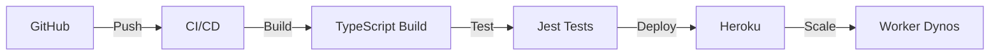
```mermaid
flowchart LR
    A[GitHub] -->|Push| B[CI/CD]
    B -->|Build| C[TypeScript Build]
    C -->|Test| D[Jest Tests]
    D -->|Deploy| E[Heroku]
    E -->|Scale| F[Worker Dynos]
```

| Stage | Tool | Configuration |
|-------|------|---------------|
| Source Control | GitHub | Protected main branch |
| CI/CD | GitHub Actions | Auto-deploy on main |
| Hosting | Heroku | Eco dynos |
| Monitoring | LogTail | Real-time alerts |

### 4.5.3 Infrastructure Requirements

| Component | Specification | Scaling |
|-----------|---------------|----------|
| Worker Dyno | 512MB RAM | Horizontal |
| MongoDB | M10 Cluster | Vertical |
| Redis | 100MB Dedicated | Horizontal |
| S3 | Standard Tier | Auto-scaling |

# 5. SYSTEM DESIGN

## 5.1 Command Line Interface Design

### 5.1.1 CLI Commands

| Command | Description | Arguments | Example |
|---------|-------------|-----------|---------|
| `start-worker` | Start worker process | `--env-file`, `--log-level` | `start-worker --env-file=.env.prod --log-level=info` |
| `seed-queue` | Add test job to Redis | `--campaign-id`, `--step` | `seed-queue --campaign-id=123 --step=0` |
| `check-status` | View worker status | `--worker-id` | `check-status --worker-id=worker1` |
| `stop-worker` | Gracefully stop worker | `--force` | `stop-worker --force` |

### 5.1.2 CLI Flow

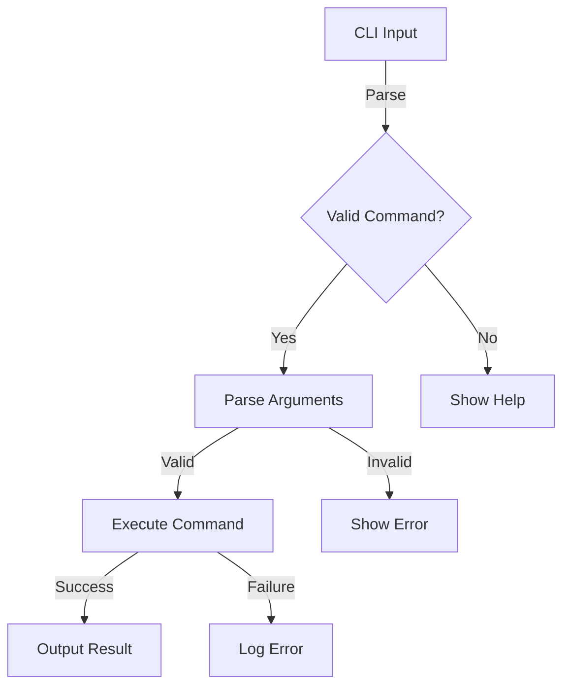
```mermaid
flowchart TD
    A[CLI Input] -->|Parse| B{Valid Command?}
    B -->|Yes| C[Parse Arguments]
    B -->|No| D[Show Help]
    C -->|Valid| E[Execute Command]
    C -->|Invalid| F[Show Error]
    E -->|Success| G[Output Result]
    E -->|Failure| H[Log Error]
```

## 5.2 Database Schema Design

### 5.2.1 MongoDB Collections

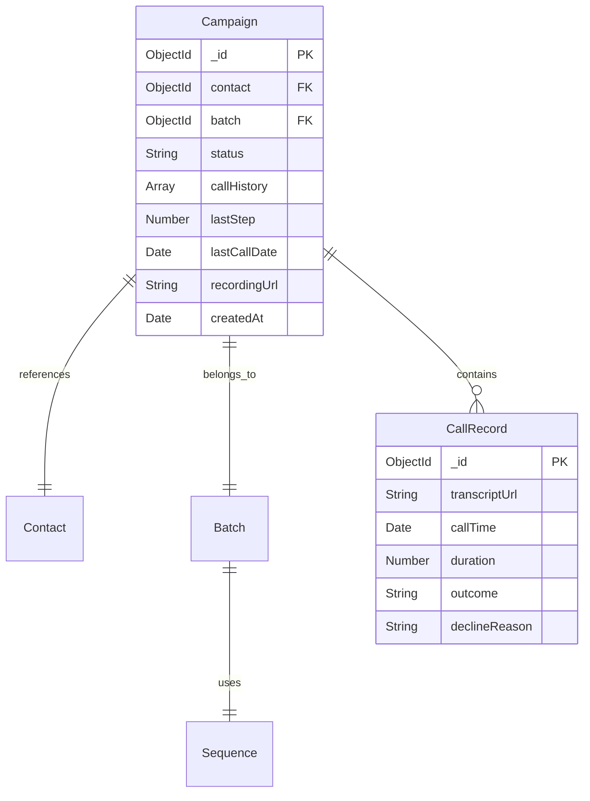
```mermaid
erDiagram
    Campaign ||--|| Contact : references
    Campaign ||--|| Batch : belongs_to
    Campaign ||--o{ CallRecord : contains
    Batch ||--|| Sequence : uses
    
    Campaign {
        ObjectId _id PK
        ObjectId contact FK
        ObjectId batch FK
        String status
        Array callHistory
        Number lastStep
        Date lastCallDate
        String recordingUrl
        Date createdAt
    }

    CallRecord {
        ObjectId _id PK
        String transcriptUrl
        Date callTime
        Number duration
        String outcome
        String declineReason
    }
```

### 5.2.2 Indexing Strategy

| Collection | Index | Type | Purpose |
|------------|-------|------|---------|
| Campaign | `{contact: 1}` | Single | Contact lookup |
| Campaign | `{status: 1, lastCallDate: 1}` | Compound | Status queries |
| CallRecord | `{callTime: 1}` | Single | Time-based queries |
| Contact | `{phone: 1}` | Single | Phone validation |

## 5.3 API Integration Design

### 5.3.1 External Service Integration

```mermaid
sequenceDiagram
    participant W as Worker
    participant L as LiveKit
    participant O as OpenAI
    participant G as Google Calendar
    participant S as S3

    W->>L: Initialize Call
    L->>O: Start Conversation
    O-->>W: Stream Response
    W->>O: Send Audio
    O-->>W: Transcription
    W->>G: Check Availability
    G-->>W: Time Slots
    W->>G: Book Meeting
    W->>S: Upload Recording
```

### 5.3.2 API Authentication

| Service | Auth Method | Token Type | Refresh Strategy |
|---------|-------------|------------|------------------|
| LiveKit | API Key | Bearer | Static |
| OpenAI | API Key | Bearer | Static |
| Google Calendar | OAuth 2.0 | Access Token | Refresh Token |
| S3 | IAM | Access Key | Role Rotation |

### 5.3.3 Error Handling

```mermaid
stateDiagram-v2
    [*] --> Attempt
    Attempt --> Success: 200 OK
    Attempt --> Retry: 5xx Error
    Attempt --> Fail: 4xx Error
    Retry --> Attempt: Backoff
    Retry --> Fail: Max Retries
    Success --> [*]
    Fail --> [*]
```

## 5.4 Worker Architecture

### 5.4.1 Process Flow

```mermaid
flowchart TD
    A[Redis Queue] -->|Job| B[Worker Process]
    B -->|Initialize| C[Voice Agent]
    C -->|Monitor| D[Sales Coach]
    C -->|Make Call| E[LiveKit]
    E -->|Audio| F[OpenAI]
    F -->|Transcript| G[S3]
    C -->|Book| H[Calendar]
    C -->|Update| I[MongoDB]
```

### 5.4.2 Component Interaction

| Component | Responsibility | Communication |
|-----------|---------------|----------------|
| Queue Consumer | Job processing | Redis RESP |
| Voice Agent | Call management | WebSocket |
| Sales Coach | Call monitoring | Internal |
| Storage Manager | Data persistence | HTTP/S3 |
| Calendar Manager | Meeting scheduling | REST |

### 5.4.3 Scaling Strategy

```mermaid
flowchart LR
    subgraph "Worker Scaling"
        A[Redis Queue] -->|Jobs| B[Load Balancer]
        B -->|Distribute| C[Worker 1]
        B -->|Distribute| D[Worker 2]
        B -->|Distribute| E[Worker N]
    end
```

## 5.5 Monitoring Architecture

### 5.5.1 Logging Strategy

```mermaid
flowchart LR
    subgraph "Logging Flow"
        A[Worker Events] -->|Stream| B[LogTail]
        C[System Metrics] -->|Push| B
        D[Error Events] -->|Alert| B
        B -->|Dashboard| E[Operations]
        B -->|Alerts| F[On-Call]
    end
```

### 5.5.2 Health Checks

| Check Type | Frequency | Threshold | Action |
|------------|-----------|-----------|---------|
| Queue Depth | 30s | >100 jobs | Scale workers |
| API Latency | 1m | >2s | Alert ops |
| Error Rate | 5m | >5% | Page on-call |
| Memory Usage | 1m | >450MB | Restart worker |

### 5.5.3 Circuit Breakers

```mermaid
stateDiagram-v2
    [*] --> Closed
    Closed --> Open: Error Threshold
    Open --> HalfOpen: Timeout
    HalfOpen --> Closed: Success
    HalfOpen --> Open: Failure
```

| Service | Error Threshold | Timeout | Reset Time |
|---------|----------------|---------|------------|
| LiveKit | 5 errors/min | 30s | 60s |
| OpenAI | 3 errors/min | 45s | 90s |
| Calendar | 10 errors/min | 60s | 120s |

# 6. USER INTERFACE DESIGN

No user interface required for this worker application. The system operates as a background worker process that:

1. Consumes jobs from Redis queue
2. Makes outbound calls via LiveKit/OpenAI
3. Updates campaign status in MongoDB
4. Stores call recordings in S3
5. Reports metrics to LogTail

All interactions are programmatic through APIs and databases. No graphical or command line interface is needed beyond basic process monitoring and logging.

For monitoring and observability, please refer to Section 5.4 which details the LogTail integration and metrics collection.

# 7. SECURITY CONSIDERATIONS

## 7.1 Authentication and Authorization

### 7.1.1 Service Authentication

| Service | Auth Method | Token Storage | Rotation Policy |
|---------|-------------|---------------|-----------------|
| LiveKit/OpenAI | API Key | Environment Variable | 90 days |
| MongoDB Atlas | Connection String | Environment Variable | On-demand |
| Redis Cloud | Password Auth | Environment Variable | 30 days |
| Google Calendar | OAuth 2.0 | Clerk Token Storage | Auto-refresh |
| AWS S3 | IAM Role | Instance Profile | Auto-rotate |
| LogTail | Source Token | Environment Variable | 180 days |

### 7.1.2 Authorization Flow

```mermaid
flowchart TD
    A[Worker Process] -->|1. Start| B{Check Env Vars}
    B -->|Missing| C[Fail Start]
    B -->|Valid| D[Initialize Services]
    D -->|2. Auth| E{Service Connections}
    E -->|Success| F[Begin Processing]
    E -->|Failure| G[Circuit Break]
    F -->|3. Monitor| H[Token Refresh]
    H -->|Expired| I[Rotate Credentials]
    I -->|Success| F
    I -->|Failure| G
```

## 7.2 Data Security

### 7.2.1 Data Classification

| Data Type | Classification | Storage Location | Encryption |
|-----------|---------------|------------------|------------|
| Call Recordings | Sensitive | S3 | AES-256 + KMS |
| Transcripts | Sensitive | S3 | AES-256 + KMS |
| Contact Info | Confidential | MongoDB | Collection-Level |
| Campaign Data | Internal | MongoDB | Collection-Level |
| Queue Jobs | Internal | Redis | TLS in-transit |
| System Logs | Internal | LogTail | TLS in-transit |

### 7.2.2 Encryption Strategy

```mermaid
flowchart LR
    subgraph "Data Security Zones"
        A[Worker Process] -->|TLS 1.3| B[(MongoDB)]
        A -->|TLS 1.3| C[(Redis)]
        A -->|TLS 1.3| D[LiveKit]
        A -->|SSL/TLS| E[S3]
        
        subgraph "Encryption At Rest"
            B -->|Collection Level| F[AES-256]
            E -->|Object Level| G[KMS]
        end
    end
```

## 7.3 Security Protocols

### 7.3.1 Network Security

| Layer | Protection Measure | Implementation |
|-------|-------------------|----------------|
| Application | Rate Limiting | Token bucket algorithm |
| Transport | TLS 1.3 | Forced TLS for all connections |
| Network | VPC Isolation | Private subnets |
| Infrastructure | Firewall Rules | Restricted port access |

### 7.3.2 Security Monitoring

```mermaid
stateDiagram-v2
    [*] --> Monitoring
    Monitoring --> Alert: Threshold Breach
    Alert --> Investigation
    Investigation --> Resolution
    Resolution --> Monitoring
    Investigation --> Incident
    Incident --> Response
    Response --> PostMortem
    PostMortem --> Monitoring
```

### 7.3.3 Security Controls

| Control Type | Measure | Description |
|--------------|---------|-------------|
| Preventive | Input Validation | Sanitize all contact data |
| Detective | Audit Logging | Track all system actions |
| Corrective | Auto-remediation | Self-heal common issues |
| Compensating | Redundancy | Multi-region backups |

### 7.3.4 Compliance Requirements

```mermaid
flowchart TD
    A[Security Requirements] -->|HIPAA| B[PHI Protection]
    A -->|TCPA| C[Call Regulations]
    A -->|State Laws| D[Recording Consent]
    A -->|Industry| E[Best Practices]
    
    B -->|Implement| F[Encryption]
    C -->|Enforce| G[Call Hours]
    D -->|Manage| H[Consent Tracking]
    E -->|Follow| I[Security Standards]
    
    F & G & H & I -->|Monitor| J[Compliance Status]
```

### 7.3.5 Incident Response

| Phase | Action | Responsible Party |
|-------|---------|------------------|
| Detection | Monitor LogTail alerts | Operations |
| Analysis | Review security logs | Security Team |
| Containment | Isolate affected systems | Operations |
| Eradication | Remove security threats | Security Team |
| Recovery | Restore normal operation | Operations |
| Post-Incident | Update security measures | Security Team |

### 7.3.6 Security Maintenance

| Task | Frequency | Description |
|------|-----------|-------------|
| Dependency Audit | Weekly | Check for vulnerable packages |
| Token Rotation | Monthly | Rotate service credentials |
| Security Scan | Daily | Automated vulnerability scan |
| Access Review | Quarterly | Review service permissions |
| Backup Testing | Monthly | Validate backup integrity |
| Incident Drill | Quarterly | Practice response procedures |

# 8. INFRASTRUCTURE

## 8.1 DEPLOYMENT ENVIRONMENT

### 8.1.1 Production Environment

| Component | Platform | Specifications | Justification |
|-----------|----------|----------------|---------------|
| Worker Service | Heroku Eco Dyno | 512MB RAM, 1x CPU | Cost-effective for single-call workers |
| Database | MongoDB Atlas | M10 Cluster | Managed service with auto-scaling |
| Queue System | Redis Cloud | 100MB Dedicated | High availability queue management |
| Storage | AWS S3 | Standard Tier | Scalable call recording storage |
| Monitoring | LogTail | Pro Plan | Real-time log aggregation |

### 8.1.2 Environment Configuration

```mermaid
flowchart TD
    subgraph "Production Environment"
        A[Heroku] -->|Deploy| B[Worker Dynos]
        B -->|Connect| C[(MongoDB Atlas)]
        B -->|Queue| D[(Redis Cloud)]
        B -->|Store| E[(AWS S3)]
        B -->|Monitor| F[LogTail]
        
        subgraph "Security Layer"
            G[SSL/TLS]
            H[IAM Roles]
            I[Network ACLs]
        end
        
        G & H & I -->|Secure| B
    end
```

## 8.2 CLOUD SERVICES

### 8.2.1 Primary Services

| Service | Provider | Purpose | Configuration |
|---------|----------|----------|---------------|
| Application Hosting | Heroku | Worker process hosting | Auto-scaling eco dynos |
| Database | MongoDB Atlas | Campaign data storage | Multi-AZ deployment |
| Queue | Redis Cloud | Job queue management | Auto-failover enabled |
| Object Storage | AWS S3 | Call recording storage | Standard storage class |
| Voice Processing | LiveKit/OpenAI | Voice synthesis | API integration |
| Calendar | Google Cloud | Meeting scheduling | OAuth 2.0 integration |

### 8.2.2 Service Architecture

```mermaid
flowchart LR
    subgraph "Cloud Architecture"
        A[Heroku Workers] -->|Read/Write| B[(MongoDB Atlas)]
        A -->|Queue| C[(Redis Cloud)]
        A -->|Store| D[(AWS S3)]
        A -->|Voice| E[LiveKit/OpenAI]
        A -->|Calendar| F[Google Cloud]
        
        subgraph "Monitoring"
            G[LogTail]
            H[Heroku Metrics]
        end
        
        A -->|Logs| G
        A -->|Metrics| H
    end
```

## 8.3 CONTAINERIZATION

### 8.3.1 Container Strategy

| Aspect | Implementation | Details |
|--------|----------------|----------|
| Base Image | Node:18-slim | Minimal production image |
| Multi-stage Build | Yes | Separate build and runtime |
| Environment Variables | Heroku Config Vars | Secure credential storage |
| Health Checks | HTTP endpoint | 30-second intervals |
| Resource Limits | 512MB RAM | Prevent memory leaks |

### 8.3.2 Dockerfile Configuration

```mermaid
flowchart TD
    subgraph "Docker Build Process"
        A[Base Image] -->|Install| B[Dependencies]
        B -->|Copy| C[Source Code]
        C -->|Build| D[TypeScript]
        D -->|Configure| E[Production Image]
        E -->|Set| F[Environment]
        F -->|Define| G[Entrypoint]
    end
```

## 8.4 ORCHESTRATION

### 8.4.1 Worker Scaling

| Metric | Threshold | Action |
|--------|-----------|--------|
| Queue Length | > 100 jobs | Scale up workers |
| Memory Usage | > 450MB | Restart worker |
| Error Rate | > 5% | Alert operations |
| CPU Usage | > 80% | Scale up workers |

### 8.4.2 Resource Management

```mermaid
flowchart LR
    subgraph "Worker Orchestration"
        A[Load Balancer] -->|Route| B[Worker Pool]
        B -->|Scale| C{Metrics}
        C -->|Queue Length| D[Add Workers]
        C -->|Low Load| E[Remove Workers]
        C -->|Errors| F[Replace Workers]
    end
```

## 8.5 CI/CD PIPELINE

### 8.5.1 Pipeline Stages

| Stage | Tool | Actions |
|-------|------|---------|
| Source Control | GitHub | Branch protection, code review |
| CI Build | GitHub Actions | TypeScript compilation, tests |
| Security Scan | Snyk | Dependency vulnerability scan |
| Quality Gate | SonarCloud | Code quality analysis |
| Deployment | Heroku | Auto-deploy on main branch |
| Monitoring | LogTail | Post-deploy health check |

### 8.5.2 Deployment Flow

```mermaid
flowchart TD
    subgraph "CI/CD Pipeline"
        A[GitHub] -->|Push| B[GitHub Actions]
        B -->|Build| C[TypeScript Build]
        C -->|Test| D[Jest Tests]
        D -->|Scan| E[Security Check]
        E -->|Quality| F[Code Analysis]
        F -->|Deploy| G[Heroku]
        G -->|Verify| H[Health Check]
        H -->|Monitor| I[LogTail]
    end
```

### 8.5.3 Deployment Configuration

| Environment | Branch | Deployment | Validation |
|-------------|--------|------------|------------|
| Development | feature/* | Manual | Unit tests |
| Staging | develop | Automatic | Integration tests |
| Production | main | Manual approval | E2E tests |

### 8.5.4 Rollback Strategy

```mermaid
stateDiagram-v2
    [*] --> Deployment
    Deployment --> HealthCheck
    HealthCheck --> Success: Passes
    HealthCheck --> Rollback: Fails
    Rollback --> PreviousVersion
    Success --> [*]
    PreviousVersion --> [*]
```

# APPENDICES

## A. ADDITIONAL TECHNICAL INFORMATION

### A.1 Voice Agent Prompt Structure

```mermaid
flowchart TD
    A[Base Prompt] -->|Merge| B[Dynamic Content]
    B -->|Interpolate| C[Contact Data]
    C -->|Initialize| D[Voice Agent]
    
    subgraph "Prompt Components"
        E[Greeting Script]
        F[DocShield Intro]
        G[Objection Handlers]
        H[Meeting Scheduling]
        I[Voicemail Script]
    end
    
    D -->|Load| E & F & G & H & I
```

### A.2 Error Recovery Patterns

| Error Type | Recovery Strategy | Max Retries | Backoff |
|------------|------------------|-------------|----------|
| API Timeout | Exponential backoff | 3 | 2^n * 1000ms |
| Network Error | Immediate retry | 2 | None |
| Voice Drop | Reconnect attempt | 1 | 5000ms |
| Queue Error | Circuit break | 5 | 1000ms |
| DB Error | Failover replica | 3 | 2000ms |

### A.3 Call Recording Format

| Attribute | Specification |
|-----------|---------------|
| Format | WAV/MP3 |
| Channels | Dual (Agent/Recipient) |
| Sample Rate | 48kHz |
| Bit Depth | 16-bit |
| Compression | Opus |

## B. GLOSSARY

| Term | Definition |
|------|------------|
| Bull Queue | Node.js library for Redis-based job queues |
| Circuit Breaker | Design pattern preventing cascading failures |
| DTMF Navigation | Phone menu navigation using touch tones |
| Eco Dyno | Heroku's resource-optimized container type |
| Function Calling | AI capability to execute predefined functions |
| LiveKit | Real-time voice and video communication platform |
| LogTail | Centralized logging and monitoring service |
| Mongoose | MongoDB object modeling for Node.js |
| Phone Tree | Automated call routing system |
| Redis Cloud | Managed Redis database service |
| Sales Coach AI | Secondary AI monitoring conversation progress |
| Voice Synthesis | AI-powered natural speech generation |

## C. ACRONYMS

| Acronym | Full Form |
|---------|-----------|
| AOF | Append-Only File |
| API | Application Programming Interface |
| AWS | Amazon Web Services |
| BSON | Binary JSON |
| CLI | Command Line Interface |
| CPU | Central Processing Unit |
| DB | Database |
| DTMF | Dual-Tone Multi-Frequency |
| IAM | Identity and Access Management |
| JSON | JavaScript Object Notation |
| KMS | Key Management Service |
| ODM | Object Document Mapper |
| RAM | Random Access Memory |
| RDB | Redis Database |
| RESP | Redis Serialization Protocol |
| REST | Representational State Transfer |
| S3 | Simple Storage Service |
| SDK | Software Development Kit |
| SSD | Solid State Drive |
| TLS | Transport Layer Security |
| TTL | Time To Live |
| URL | Uniform Resource Locator |
| UUID | Universally Unique Identifier |
| VPC | Virtual Private Cloud |

## D. REFERENCE IMPLEMENTATIONS

### D.1 Redis Job Structure

```mermaid
classDiagram
    class Job {
        +string id
        +string campaignId
        +number step
        +boolean finalStep
        +Date createdAt
        +string status
        +Object data
        +process()
        +complete()
        +fail()
    }
    
    class Queue {
        +string name
        +Object options
        +add()
        +process()
        +getJob()
        +removeJob()
    }
    
    Job --> Queue
```

### D.2 Voice Agent State Machine

```mermaid
stateDiagram-v2
    [*] --> Initializing
    Initializing --> Dialing: Start Call
    Dialing --> NavigatingMenu: Connected
    Dialing --> LeavingVoicemail: Voicemail
    NavigatingMenu --> Speaking: Reach Person
    Speaking --> Scheduling: Meeting Agreed
    Speaking --> Closing: Meeting Declined
    Scheduling --> Closing: Calendar Updated
    Closing --> [*]: End Call
    LeavingVoicemail --> [*]: Message Left
```