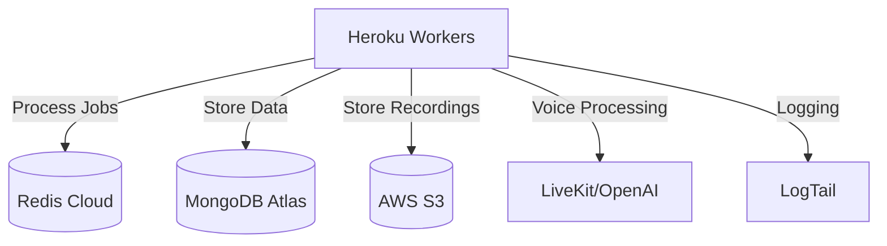

# DocShield AI Voice Agent Infrastructure Documentation

Version: 1.0  
Last Updated: 2024-01-20  
Maintainers: DevOps Team  
Next Review: 2024-02-20

## Table of Contents

1. [Overview](#overview)
2. [Prerequisites](#prerequisites)
3. [Infrastructure Components](#infrastructure-components)
4. [Deployment Guide](#deployment-guide)
5. [Monitoring](#monitoring)
6. [Maintenance](#maintenance)
7. [Troubleshooting](#troubleshooting)

## Overview

### System Architecture

The DocShield AI Voice Agent infrastructure is built on a distributed architecture leveraging cloud-native services:



### Component Overview

- **Worker Service**: Heroku-hosted Node.js workers for call processing
- **Queue System**: Redis Cloud for job management
- **Database**: MongoDB Atlas for campaign data
- **Storage**: AWS S3 for call recordings
- **Monitoring**: LogTail for centralized logging

### Environment Setup

The system operates across three environments:
- Development: Feature branch testing
- Staging: Integration testing
- Production: Live operations

## Prerequisites

### Required Tools

| Tool | Version | Purpose |
|------|---------|---------|
| Terraform | >= 1.0 | Infrastructure provisioning |
| Docker | >= 20.10 | Container management |
| Heroku CLI | Latest | Deployment management |
| AWS CLI | v2 | S3 bucket management |
| MongoDB Atlas Account | N/A | Database management |
| Redis Cloud Account | N/A | Queue management |

### Access Requirements

- Heroku account with deployment permissions
- AWS IAM credentials with S3 access
- MongoDB Atlas organization access
- Redis Cloud subscription access
- GitHub repository access

## Infrastructure Components

### Worker Service (Heroku Eco Dyno)

```yaml
Specifications:
- RAM: 512MB
- CPU: 1x
- Auto-scaling: Enabled
- Health checks: 30s intervals
- Resource limits: Enforced
```

### Database (MongoDB Atlas)

```yaml
Specifications:
- Cluster: M10
- Nodes: 3 (Primary + 2 Replicas)
- Auto-scaling: Enabled
- Backup: Daily snapshots
- Monitoring: Built-in
```

### Queue (Redis Cloud)

```yaml
Specifications:
- Memory: 100MB Dedicated
- Persistence: AOF enabled
- Auto-failover: Enabled
- Monitoring: Real-time metrics
- Backup: Every 6 hours
```

### Storage (AWS S3)

```yaml
Specifications:
- Tier: Standard
- Encryption: AES-256
- Lifecycle: 90-day retention
- Versioning: Enabled
- Access: IAM roles
```

## Deployment Guide

### Infrastructure Provisioning

1. Initialize Terraform:
```bash
cd terraform
terraform init
terraform plan -var-file=prod.tfvars
terraform apply -var-file=prod.tfvars
```

### Container Deployment

1. Build worker container:
```bash
docker build -t docshield-worker:latest .
```

2. Deploy to Heroku:
```bash
heroku container:push worker
heroku container:release worker
```

### Health Verification

1. Check worker status:
```bash
heroku ps:status
```

2. Verify MongoDB connection:
```bash
heroku run node verify-mongo.js
```

### Rollback Procedures

1. Revert to previous release:
```bash
heroku rollback
```

2. Verify system health:
```bash
./scripts/health-check.sh
```

## Monitoring

### LogTail Integration

```yaml
Configuration:
- Source: Heroku logs
- Retention: 30 days
- Alerts: Configured
- Dashboards: Custom
```

### Performance Metrics

| Metric | Warning Threshold | Critical Threshold |
|--------|------------------|-------------------|
| CPU Usage | 70% | 85% |
| Memory Usage | 450MB | 490MB |
| Queue Length | 100 | 200 |
| Error Rate | 5% | 10% |

### Health Checks

- Worker heartbeat: 30s
- MongoDB connection: 60s
- Redis connection: 30s
- S3 access: 120s

## Maintenance

### Daily Tasks

- [ ] Review error logs
- [ ] Check queue metrics
- [ ] Verify backup completion
- [ ] Monitor resource usage

### Weekly Tasks

- [ ] Security updates
- [ ] Performance analysis
- [ ] Capacity planning
- [ ] Backup testing

### Monthly Tasks

- [ ] Infrastructure audit
- [ ] Cost optimization
- [ ] Scaling assessment
- [ ] Security review

### Quarterly Tasks

- [ ] Disaster recovery test
- [ ] Load testing
- [ ] Compliance review
- [ ] Documentation update

## Troubleshooting

### Common Issues

1. Worker Connection Failures
```bash
# Check worker logs
heroku logs --tail --dyno worker

# Verify Redis connection
heroku run node verify-redis.js
```

2. Database Performance Issues
```bash
# Check MongoDB metrics
mongosh "mongodb+srv://cluster0.example.net/admin" --eval "db.serverStatus()"
```

3. Queue Processing Delays
```bash
# Monitor queue length
redis-cli -h $REDIS_HOST INFO | grep queue
```

4. Storage Access Problems
```bash
# Verify S3 access
aws s3 ls s3://docshield-recordings/
```

### Performance Optimization

1. Worker Optimization
- Adjust concurrency settings
- Monitor memory usage
- Optimize job processing

2. Database Optimization
- Index review
- Query optimization
- Connection pooling

3. Queue Optimization
- Job batching
- TTL configuration
- Memory management

### Emergency Contacts

| Role | Contact | Hours |
|------|---------|-------|
| DevOps Lead | devops@docshield.com | 24/7 |
| Database Admin | dba@docshield.com | Business Hours |
| Security Team | security@docshield.com | 24/7 |

---

For additional support, please contact the DevOps team or refer to the internal documentation portal.