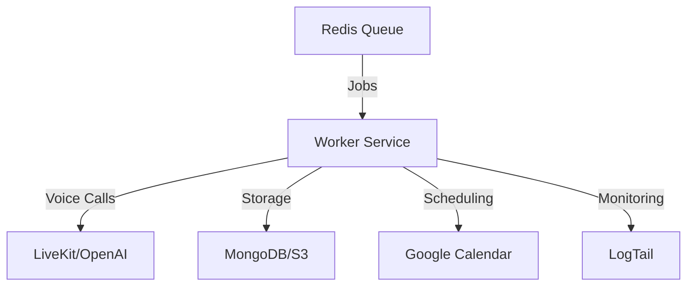
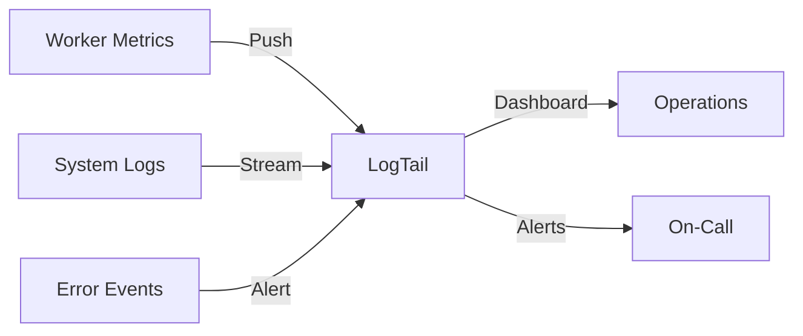

# DocShield AI Voice Agent Worker Service

[](../../.github/workflows/ci.yml)
[](./coverage/lcov-report)


Enterprise-grade autonomous sales outreach system for conducting malpractice insurance sales calls to medical practices.

## Overview



The DocShield AI Voice Agent Worker Service is a Node.js-based autonomous system that:
- Processes outbound sales call jobs from Redis queues
- Conducts natural voice conversations using LiveKit/OpenAI
- Navigates phone trees to reach decision makers
- Schedules meetings via Google Calendar integration
- Records and transcribes calls with secure S3 storage
- Provides real-time monitoring via LogTail

## Prerequisites

- Node.js >= 18.0.0 LTS
- Docker with multi-stage build support
- MongoDB Atlas M10 cluster
- Redis Cloud 100MB dedicated instance
- AWS S3 bucket with proper IAM roles
- LiveKit account and API credentials
- OpenAI API access (GPT-4 enabled)
- Google Cloud Platform project with Calendar API
- LogTail account for monitoring

## Installation

1. Clone the repository:
```bash
git clone <repository-url>
cd src/backend
```

2. Install dependencies:
```bash
npm install
```

3. Configure environment variables:
```bash
cp .env.example .env
# Edit .env with your service credentials
```

4. Initialize development environment:
```bash
npm run setup:dev
```

## Development

### Available Scripts

```bash
# Start development worker
npm run dev

# Run tests
npm run test

# Run linting
npm run lint

# Build production
npm run build

# Start production worker
npm run start
```

### Project Structure

```
src/backend/
├── src/
│   ├── workers/         # Worker service implementations
│   ├── services/        # Core service integrations
│   ├── models/          # Database models
│   ├── utils/           # Helper utilities
│   └── config/          # Configuration management
├── tests/               # Test suites
├── Dockerfile          # Multi-stage container build
├── package.json        # Dependencies and scripts
└── tsconfig.json       # TypeScript configuration
```

### Testing

- Unit tests: `npm run test:unit`
- Integration tests: `npm run test:integration`
- Coverage report: `npm run test:coverage`

## Deployment

### Docker Build

```bash
# Build production image
docker build -t docshield-worker .

# Run container
docker run -d --env-file .env docshield-worker
```

### Heroku Deployment

```bash
# Login to Heroku
heroku login

# Deploy to Heroku
git push heroku main

# Scale workers
heroku ps:scale worker=3
```

### Environment Variables

Required environment variables (see .env.example):

```env
# Service Configuration
NODE_ENV=production
LOG_LEVEL=info

# Database
MONGODB_URI=mongodb+srv://...
REDIS_URL=rediss://...

# APIs
LIVEKIT_API_KEY=key_...
LIVEKIT_API_SECRET=secret_...
OPENAI_API_KEY=sk-...
GOOGLE_CLIENT_ID=...
GOOGLE_CLIENT_SECRET=...

# Storage
AWS_ACCESS_KEY_ID=...
AWS_SECRET_ACCESS_KEY=...
AWS_REGION=us-east-1
S3_BUCKET=docshield-recordings

# Monitoring
LOGTAIL_SOURCE_TOKEN=...
```

## Security

### API Key Management

- All API keys stored in Heroku Config Vars
- Keys rotated every 90 days
- Access logs monitored via LogTail

### Data Security

- Call recordings encrypted with AES-256
- MongoDB Atlas encryption at rest
- TLS 1.3 for all connections
- IAM roles for AWS services

### Compliance

- HIPAA-compliant data handling
- TCPA-compliant call procedures
- Call recording consent tracking
- Regular security audits

## Monitoring



### Health Checks

- Queue depth monitoring
- API latency tracking
- Error rate alerting
- Memory usage monitoring
- CPU utilization tracking

## Maintenance

- Last Updated: 2024-01-20
- Version Compatibility:
  - Node.js: >=18.0.0
  - npm: >=8.0.0
  - TypeScript: >=4.9.0
- Update Frequency: Monthly or on significant changes
- Maintainers: DocShield Engineering Team

## Support

For technical support or questions:
1. Review existing documentation
2. Check LogTail dashboards
3. Contact DevOps team
4. Escalate to engineering leads

## License

UNLICENSED - Proprietary software of DocShield